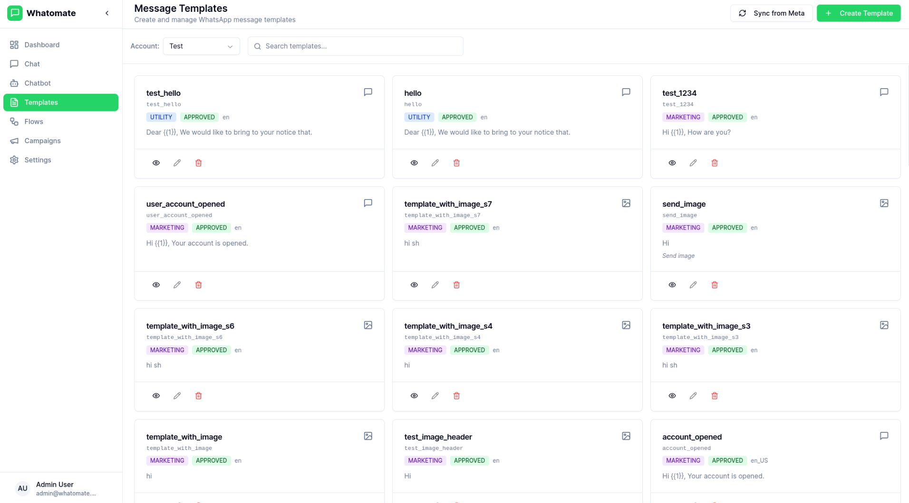
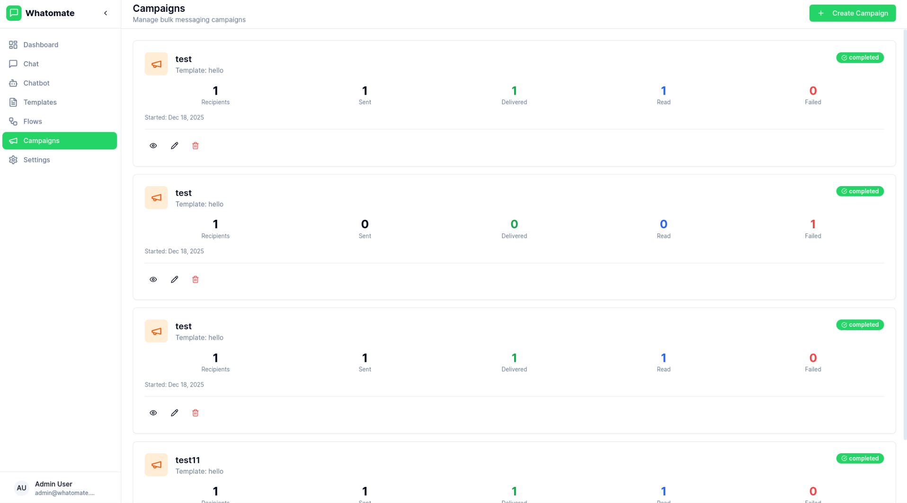

# Whatomate

Modern, open-source WhatsApp Business Platform. Support for both **WhatsApp Cloud API (Meta)** and **WhatsApp Web Protocol (whatsmeow)**. Single binary app.


## Features

- **Multi-tenant Architecture**
  Support multiple organizations with isolated data and configurations.

- **Dual Provider Support**
  Choose between **Meta's WhatsApp Cloud API** for official business integration or **Whatsmeow** (WhatsApp Web protocol) for QR-code based multi-instance support without API costs.

- **Granular Roles & Permissions**
  Customizable roles with fine-grained permissions. Create custom roles, assign specific permissions per resource (users, contacts, templates, etc.), and control access at the action level (read, create, update, delete). Super admins can manage multiple organizations.

- **Real-time Chat**
  Live messaging with WebSocket support for instant communication, featuring instance tags for easy identification.

- **Template Management**
  Create and manage message templates (Meta provider) or send regular messages (Whatsmeow).

- **Bulk Campaigns**
  Send campaigns to multiple contacts with retry support for failed messages.

- **Chatbot Automation**
  Keyword-based auto-replies, conversation flows with branching logic, and AI-powered responses (OpenAI, Anthropic, Google).

- **Canned Responses**
  Pre-defined quick replies with slash commands (`/shortcut`) and dynamic placeholders.

- **Analytics Dashboard**
  Track messages, engagement, and campaign performance.

<details>
<summary>View more screenshots</summary>





</details>

## Installation

### Docker

The latest image is available on Docker Hub at [`compnew2006/whatomate:latest`](https://hub.docker.com/r/compnew2006/whatomate)

```bash
# Download compose file and sample config
curl -LO https://raw.githubusercontent.com/compnew2006/whatomate/main/docker/docker-compose.yml
curl -LO https://raw.githubusercontent.com/compnew2006/whatomate/main/config.example.toml

# Copy and edit config
cp config.example.toml config.toml

# Generate JWT secret once and set it in config.toml (jwt.secret)
openssl rand -hex 32

# Generate encryption key and set it in config.toml (app.encryption_key)
openssl rand -hex 32

# Run services
docker compose up -d
```

Go to `http://localhost:8080` and login with `admin@admin.com` / `admin`

---

### Binary

Download the [latest release](https://github.com/compnew2006/whatomate/releases) and extract the binary.

```bash
# Copy and edit config
cp config.example.toml config.toml

# Generate JWT secret once and set it in config.toml (jwt.secret)
openssl rand -hex 32

# Generate encryption key and set it in config.toml (app.encryption_key)
openssl rand -hex 32

# Run with migrations
./whatomate server -migrate
```

Go to `http://localhost:8080` and login with `admin@admin.com` / `admin`

---

### Build from Source

```bash
git clone https://github.com/compnew2006/whatomate.git
cd whatomate

# Production build (single binary with embedded frontend)
make build-prod
./whatomate server -migrate
```

## Deployment

The binary produced by `make build-prod` is **standalone** and works solo. It includes the embedded frontend, so you do not need a separate frontend server.

To deploy in production:

1.  Copy the `whatomate` binary to your server.
2.  Provide a `config.toml` file.
3.  Ensure access to a PostgreSQL database and a Redis instance.
4.  Run the server: `./whatomate server -migrate`

See [configuration docs](https://github.com/compnew2006/whatomate/docs) for detailed setup options.

## CLI Usage

```bash
./whatomate server              # API + 1 worker (default)
./whatomate server -workers=0   # API only
./whatomate worker -workers=4   # Workers only (for scaling)
./whatomate version             # Show version
```

## Developers

The backend is written in Go ([Fastglue](https://github.com/zerodha/fastglue)) and the frontend is Vue.js 3 with shadcn-vue.

- If you are interested in contributing, please read [CONTRIBUTING.md](./CONTRIBUTING.md) first.

```bash
# Development setup
make run-migrate    # Backend (port 8080)
cd frontend && npm install && npm run dev   # Frontend (port 3000)
```

## MCP Sidecar

This repository includes a production MCP sidecar in [`mcp-server`](./mcp-server), implemented with `@modelcontextprotocol/sdk@1.27.0`.

Implementation highlights:

- Modular MCP server with dedicated registries for Tools, Resources, and Prompts
- Typed Whatomate API client with envelope parsing, timeout budget, and retry-on-GET behavior
- OpenAI connector example (`whatomate_openai_summarize_conversation`)
- Transport support for:
  - `stdio` (local MCP host integration)
  - Streamable HTTP `/mcp` (primary remote transport)
  - Legacy SSE compatibility (`/sse`, `/messages`) behind feature flag
- Security hardening with bearer auth, Zod input/config validation, outbound host allowlisting, and sanitized errors

Quick start (stdio):

```bash
cd mcp-server
npm install
cp .env.example .env
npm run build
MCP_TRANSPORT=stdio \
WHATOMATE_BASE_URL=http://localhost:8080 \
WHATOMATE_API_KEY=whm_replace_me \
OPENAI_API_KEY=sk_replace_me \
npm run start:stdio
```

Quick start (HTTP):

```bash
cd mcp-server
MCP_TRANSPORT=http \
MCP_HTTP_HOST=127.0.0.1 \
MCP_HTTP_PORT=3000 \
MCP_HTTP_BEARER_TOKEN=replace_me \
WHATOMATE_BASE_URL=http://localhost:8080 \
WHATOMATE_API_KEY=whm_replace_me \
OPENAI_API_KEY=sk_replace_me \
npm run start:http
```

HTTP endpoints:

- `POST/GET/DELETE /mcp` (MCP streamable HTTP transport)
- `GET /healthz`
- `GET /sse` + `POST /messages` (only when `MCP_ENABLE_LEGACY_SSE=true`)

Compose profile:

```bash
docker compose -f docker/docker-compose.yml --profile mcp up -d --build
```

For full implementation details, environment reference, and TypeScript client usage example, see [`mcp-server/README.md`](./mcp-server/README.md).

## License

See [LICENSE](LICENSE) for details.
