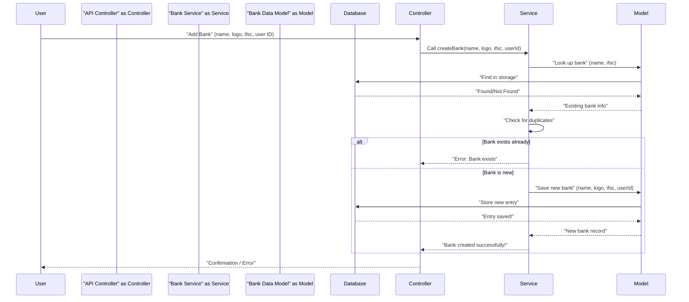

# Chapter 1: Business Logic Services

Welcome to the ExpenseMeter project tutorial! In this chapter, we're going to explore a fundamental concept that helps our application work smoothly: **Business Logic Services**.

Imagine our ExpenseMeter application is like a busy restaurant. You, the user, are the customer. You tell the waiter (which we'll learn about in a later chapter as [API Controllers](03_api_controllers_.md)) what you want to do – maybe "add a new bank account" or "create a budget."

Now, you wouldn't expect the waiter to go into the kitchen and cook your meal from scratch, right? That's the chef's job! In ExpenseMeter, our **Business Logic Services** are like the expert chefs. They are the "brains" or "workers" that know *exactly* how to perform specific tasks.

### The Core Idea: What are Business Logic Services?

In simple terms, Business Logic Services are special code files that:

*   **Perform core operations**: They handle the actual "doing" of things, like saving a new transaction, updating a budget, or calculating your total expenses.
*   **Apply business rules**: They ensure that all the rules of our application are followed. For example, you can't create two bank accounts with the exact same name or IFSC code. The service checks for this!
*   **Talk to the Database**: To do their job, services need to store and retrieve information. They do this by communicating with our [Data Models (MongoDB Schemas)](02_data_models__mongodb_schemas_.md), which are like special forms or blueprints for how data is structured in our database.

Think of it this way:

*   **You (User)**: Want to do something.
*   **[API Controller](03_api_controllers_.md) (Waiter)**: Takes your request.
*   **Business Logic Service (Chef)**: Knows how to fulfill the request, checks rules, and interacts with the database.
*   **[Data Model](02_data_models__mongodb_schemas_.md) (Recipe Card)**: Tells the Chef how to structure the ingredients (data).
*   **Database (Pantry/Storage)**: Where all the ingredients (data) are actually kept.

### A Practical Example: Creating a New Bank

Let's say you want to add a new bank account to your ExpenseMeter app. This is a perfect job for a Business Logic Service!

From the perspective of another part of the app (like an [API Controller](03_api_controllers_.md)), you would simply call a function from our `bankService` to create a new bank.

```javascript
// Imagine this code is in an API Controller (more on this later!)
const bankService = require('../services/bankService'); // Get our "chef" for banks

const newBankName = "My Awesome Digital Bank";
const newBankLogo = "https://example.com/digital-logo.png";
const newBankIfsc = "DIGI0001234";
const currentUserId = "user123_abc"; // The ID of the logged-in user

async function addNewBank() {
    try {
        const createdBank = await bankService.createBank(
            newBankName,
            newBankLogo,
            newBankIfsc,
            currentUserId
        );
        console.log("Success! Bank created:", createdBank.name);
        // Output might look like: Success! Bank created: My Awesome Digital Bank
    } catch (error) {
        console.error("Error creating bank:", error.message);
        // Output might look like: Error creating bank: Bank already exists with this name or IFSC code
    }
}

addNewBank();
```

In this example, the `bankService.createBank` function is the hero. We give it the bank's details and the user ID, and it takes care of everything else. It will either successfully create the bank and return its details, or it will tell us if something went wrong (like if a bank with that name already exists).

### How It Works Behind the Scenes (The Chef's Kitchen)

Let's peek into the chef's kitchen to see what happens when `bankService.createBank` is called.

1.  **Request Arrives**: The [API Controller](03_api_controllers_.md) receives your "Add Bank" request.
2.  **Service Called**: The [API Controller](03_api_controllers_.md) passes your bank details to the `bankService` (our specialized chef).
3.  **Check the Rules**: The `bankService` doesn't just blindly save data. First, it consults the existing records in the database (via the [Data Model](02_data_models__mongodb_schemas_.md)) to make sure there isn't already a bank with the exact same name or IFSC code for *your* account. This is a crucial "business rule"!
4.  **Decision Time**:
    *   If a duplicate bank is found, the service stops and reports an error back to the [API Controller](03_api_controllers_.md).
    *   If no duplicate is found, the service proceeds.
5.  **Save to Database**: The `bankService` then instructs the [Data Model](02_data_models__mongodb_schemas_.md) on how to properly format and store this new bank's information in our database.
6.  **Confirmation**: Once saved, the `bankService` gets confirmation from the [Data Model](02_data_models__mongodb_schemas_.md) and sends the details of the newly created bank back to the [API Controller](03_api_controllers_.md).
7.  **User Notified**: Finally, the [API Controller](03_api_controllers_.md) sends a success message (or the error) back to you.

Here's a visual flow of this process:



### Diving into the Code: `backend/services/bankService.js`

Now, let's look at a simplified version of the actual code in `backend/services/bankService.js` to see how our "chef" does its work.

First, a service needs to know how to talk to the database. It does this by importing the relevant [Data Model](02_data_models__mongodb_schemas_.md).

```javascript
// File: backend/services/bankService.js
const bankModel = require("../models/Bank.model");
const transactionModel = require("../models/Transaction.model"); // Also needs transactions for summary

// bankModel is our "recipe card" for banks.
// transactionModel is another "recipe card" for transactions.
```

The `bankModel` is like the blueprint or form that tells our service how bank data should look and how to interact with the database regarding banks.

Next, let's look at the `createBank` function itself:

```javascript
// File: backend/services/bankService.js (simplified)
const createBank = async (name, logo, ifsc, userId) => {
    // 1. First, check if a bank with this name or IFSC already exists for this user.
    const existingBank = await bankModel.findOne({ 
        $or: [{ name }, { ifsc }] // Check by name OR IFSC
    });
    if (existingBank) {
        // If it exists, stop here and report an error (business rule!)
        throw new Error("Bank already exists with this name or IFSC code");
    }
    
    // 2. If no existing bank, go ahead and create the new bank entry.
    const bank = await bankModel.create({ name, logo, ifsc, user_id: userId });
    
    // 3. Return the newly created bank's information.
    return bank;
};
```

**Explanation:**
*   `await bankModel.findOne(...)`: This line asks the `bankModel` (our recipe card for banks) to check the database for any existing banks that match the provided `name` or `ifsc` code. The `await` keyword means the service will "wait" for the database to respond before continuing.
*   `if (existingBank)`: This is where our business logic kicks in. If `findOne` finds a bank, it means we have a duplicate, and we throw an `Error`.
*   `await bankModel.create(...)`: If no duplicate is found, this line tells the `bankModel` to save the new bank details into the database.
*   `return bank`: Finally, the newly created bank's data is sent back to whoever called this function.

Services also handle other operations related to banks, such as fetching all banks or deleting them. Notice they all use the `bankModel` to interact with the database.

```javascript
// File: backend/services/bankService.js (simplified examples)

const getAllBanks = async (userId) => {
    // Find all active banks belonging to a specific user and sort them by name.
    const banks = await bankModel.find({ isActive: true, user_id: userId }).sort({ name: 1 });
    return banks;
};

const deleteBankById = async (id, userId) => {
    // Instead of deleting permanently, we often "soft-delete" by setting isActive to false.
    const bank = await bankModel.findByIdAndUpdate(
        id, 
        { isActive: false, user_id: userId, updatedAt: Date.now() }, 
        { new: true }
    );
    if (!bank) {
        throw new Error("Bank not found");
    }
    return bank;
};
```

These functions show how services centralize various actions related to a single data type (banks). They all know how to interact with the `bankModel` and apply specific rules (like `isActive: true` or handling "not found" scenarios).

### Why Separate Services?

You might wonder why we don't just put all this logic directly into the [API Controllers](03_api_controllers_.md). Here's why separating services is a good idea:

| Without Services (Messy)                             | With Services (ExpenseMeter Approach)                   |
| :--------------------------------------------------- | :------------------------------------------------------ |
| **Logic is scattered**: Rules are all over the place. | **Organized code**: All "bank-related" logic is in `bankService.js`. |
| **Hard to change rules**: Need to update many places. | **Easy to update rules**: Change logic in one service file. |
| **More errors**: Rules might be applied inconsistently. | **Fewer errors**: Rules applied consistently by the service. |
| **Difficult to test**: Testing requires checking many files. | **Easier to test**: Can test services independently. |

By using services, our ExpenseMeter app becomes more organized, easier to manage, and more reliable!

### Conclusion

In this chapter, we've learned that Business Logic Services are the intelligent workers of our ExpenseMeter application. They take requests, apply important rules, and interact with the database to get things done. They keep our code clean, consistent, and easy to maintain.

Now that we understand who does the work, let's look at *what* they work with: the blueprints for our data! In the next chapter, we'll dive into [Data Models (MongoDB Schemas)](02_data_models__mongodb_schemas_.md).

---

<sub><sup>Generated by [AI Codebase Knowledge Builder](https://github.com/The-Pocket/Tutorial-Codebase-Knowledge).</sup></sub> <sub><sup>**References**: [[1]](https://github.com/gajendranasokkumar/ExpenseMeter/blob/cb7cf86a3b1c26a2af66661d5e1c888aaaf5bdfd/backend/services/bankService.js), [[2]](https://github.com/gajendranasokkumar/ExpenseMeter/blob/cb7cf86a3b1c26a2af66661d5e1c888aaaf5bdfd/backend/services/budgetService.js), [[3]](https://github.com/gajendranasokkumar/ExpenseMeter/blob/cb7cf86a3b1c26a2af66661d5e1c888aaaf5bdfd/backend/services/categoryService.js), [[4]](https://github.com/gajendranasokkumar/ExpenseMeter/blob/cb7cf86a3b1c26a2af66661d5e1c888aaaf5bdfd/backend/services/exportService.js), [[5]](https://github.com/gajendranasokkumar/ExpenseMeter/blob/cb7cf86a3b1c26a2af66661d5e1c888aaaf5bdfd/backend/services/notificationService.js), [[6]](https://github.com/gajendranasokkumar/ExpenseMeter/blob/cb7cf86a3b1c26a2af66661d5e1c888aaaf5bdfd/backend/services/statisticsService.js), [[7]](https://github.com/gajendranasokkumar/ExpenseMeter/blob/cb7cf86a3b1c26a2af66661d5e1c888aaaf5bdfd/backend/services/transactionService.js), [[8]](https://github.com/gajendranasokkumar/ExpenseMeter/blob/cb7cf86a3b1c26a2af66661d5e1c888aaaf5bdfd/backend/services/userService.js)</sup></sub>