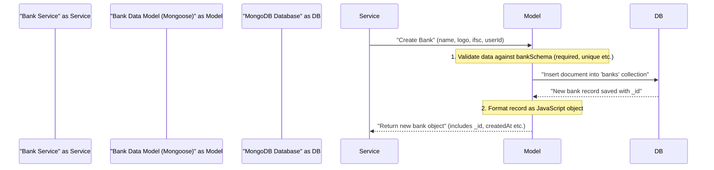

# Chapter 2: Data Models (MongoDB Schemas)

Welcome back, future ExpenseMeter master! In our last chapter, we met the "chefs" of our application: the [Business Logic Services](01_business_logic_services_.md). These services are busy performing tasks like "creating a new bank" or "adding a transaction." But how do these chefs know *what* ingredients to use and *how* to arrange them when they interact with the database?

That's where **Data Models (MongoDB Schemas)** come in! They are like the **recipe cards** for our chefs. Just as a chef needs a recipe card to know how to prepare a dish consistently, our services need data models to know how to store and retrieve different types of information in our database consistently.

### The Core Idea: What are Data Models (MongoDB Schemas)?

Imagine you're tracking expenses. You have different types of information:

*   **Users**: Each user has a name, email, and password.
*   **Banks**: Each bank has a name, logo, and an IFSC code.
*   **Transactions**: Each transaction has an amount, a category, and a date, and it's linked to a user and a bank.

Without a clear structure, saving this information would be messy! You might accidentally save a bank without a name, or a transaction without an amount. This leads to errors and confusion.

**Data Models** (specifically **MongoDB Schemas** using a tool called Mongoose) solve this. They are **blueprints** or **templates** that define:

1.  **What pieces of information (fields) belong to a specific type of data.** (e.g., a "Bank" *must* have a `name`, `logo`, and `ifsc`).
2.  **What kind of data each field should hold (data type).** (e.g., `name` should be `String`, `amount` should be `Number`).
3.  **Any special rules for that information.** (e.g., `name` is `required`, `ifsc` must be `unique`).

In ExpenseMeter, we use **MongoDB** as our database, which is known for its flexibility (you don't *strictly* need a fixed schema). However, using **Mongoose Schemas** gives us the best of both worlds: the flexibility of MongoDB with the structure and validation benefits of a schema.

### Key Concepts: Breaking Down the "Recipe Card"

Let's look at the ingredients of a Mongoose Schema:

#### 1. Defining Fields and Types

This is like listing the ingredients on a recipe card. For a Bank, we need:

*   `name`: The bank's name (e.g., "My Awesome Digital Bank"). This should be text.
*   `logo`: The bank's logo (e.g., "https://example.com/digital-logo.png"). This should be a link (text).
*   `ifsc`: The bank's IFSC code (e.g., "DIGI0001234"). This should be text.

In Mongoose, we define these fields and their data types:

```javascript
// Part of backend/models/Bank.model.js
const bankSchema = new mongoose.Schema({
    name: {
        type: String, // Data type is a string (text)
    },
    logo: {
        type: String, // Data type is a string (text)
    },
    ifsc: {
        type: String, // Data type is a string (text)
    },
    // ... more fields
});
```

#### 2. Adding Rules (Validation and Constraints)

A recipe card doesn't just list ingredients; it also has instructions!
*   "A dash of salt" (not too much, not too little).
*   "Must be baked for 30 minutes."

In our schemas, these are rules like:

*   `required: true`: This field *must* be provided. Like a cake recipe *requiring* flour.
*   `unique: true`: No two entries can have the same value for this field. Like an IFSC code must be unique for each bank.
*   `default: true`: If no value is provided, use this default. Like `isActive` is `true` by default.
*   `min`, `max`: For numbers, set a minimum or maximum value.

Let's enhance our `Bank` schema with rules:

```javascript
// Part of backend/models/Bank.model.js
const bankSchema = new mongoose.Schema({
    name: {
        type: String,
        required: true, // A bank must have a name!
        unique: true,   // No two banks can have the same name.
    },
    logo: {
        type: String,
        required: true, // A bank must have a logo URL.
    },
    ifsc: {
        type: String,
        required: true, // A bank must have an IFSC code.
        unique: true,   // IFSC codes must be unique across all banks.
    },
    isActive: {
        type: Boolean,
        default: true,  // Banks are active by default.
    },
    // ... more fields
});
```
When a [Business Logic Service](01_business_logic_services_.md) tries to save a bank without a name, or with a duplicate IFSC, the `bankModel` will immediately tell it "Hey, that's not allowed by the recipe!"

#### 3. Linking Data (Relationships with `ObjectId` and `ref`)

Our ExpenseMeter app is all about connections!
*   A "Transaction" belongs to a "User."
*   A "Transaction" happens at a "Bank."

These connections are handled using special identifiers called `ObjectId`s. Think of them as unique serial numbers for each piece of data.

*   When a new User is created, MongoDB gives it a unique `_id` (e.g., `60d5ec49c3b0f5b9f7a3d2e1`).
*   When a new Bank is created, it also gets a unique `_id`.

To link a `Transaction` to a `User` and `Bank`, we simply store their `_id`s in the `Transaction`'s data:

```javascript
// Part of backend/models/Transaction.model.js
const transactionSchema = new mongoose.Schema({
    user_id: {
        type: mongoose.Schema.Types.ObjectId, // This field will store a User's ID
        ref: 'User',                           // And this ID refers to the 'User' model
        required: true,
    },
    bank: {
        type: mongoose.Schema.Types.ObjectId, // This field will store a Bank's ID
        ref: 'banks',                          // And this ID refers to the 'banks' collection
        required: true,
    },
    // ... other transaction fields
});
```

*   `type: mongoose.Schema.Types.ObjectId`: This tells Mongoose that this field expects a MongoDB `ObjectId`.
*   `ref: 'User'` (or `ref: 'banks'`): This is helpful for Mongoose. It tells Mongoose which other "recipe card" (model) this `ObjectId` is referring to. This allows us to easily "join" or "populate" data later.

### A Practical Example: The Bank Data Model

Let's revisit the "creating a new bank" example from Chapter 1. The `bankService` needed to save a new bank. It did this by interacting with the `bankModel`.

The full `Bank.model.js` file looks like this:

```javascript
// File: backend/models/Bank.model.js
const mongoose = require("mongoose");

const bankSchema = new mongoose.Schema({
    name: {
        type: String,
        required: true,
        unique: true, // Bank names must be unique
    },
    logo: {
        type: String,
        required: true,
    },
    ifsc: {
        type: String,
        required: true,
        unique: true, // IFSC codes must be unique
    },
    isActive: {
        type: Boolean,
        default: true, // Default to active
    },
    user_id: {
        type: mongoose.Schema.Types.ObjectId, // Link to a User
        ref: 'User', // Refers to the 'User' model
        required: true,
        index: true, // Helps with faster lookups
    },
    createdAt: {
        type: Date,
        default: Date.now,
    },
    updatedAt: {
        type: Date,
        default: Date.now,
    },
});

// A special instruction: Update the updatedAt field before saving
bankSchema.pre('save', function(next) {
    this.updatedAt = Date.now();
    next();
});

const bankModel = mongoose.model("banks", bankSchema); // 'banks' is the collection name

module.exports = bankModel;
```

**Explanation:**

*   `const mongoose = require("mongoose");`: We start by importing Mongoose, the library that helps us define schemas and interact with MongoDB easily.
*   `new mongoose.Schema(...)`: This is where we define our "recipe card" for a bank.
*   Each field (like `name`, `logo`, `ifsc`, `user_id`) is defined with its `type` and rules.
*   `bankSchema.pre('save', ...)`: This is a "hook" that runs *before* a document is saved. Here, it ensures the `updatedAt` field is always current.
*   `mongoose.model("banks", bankSchema);`: This line creates an actual **Model** (the chef's "tool" to use the recipe card) from our `bankSchema`. We call this model `bankModel`, and it will manage a collection named `banks` in our MongoDB database. This `bankModel` is what our [Business Logic Services](01_business_logic_services_.md) use to `create`, `find`, or `update` bank data.

### How it Works Behind the Scenes

Let's revisit our `createBank` function from the `bankService` (our chef). When it calls `bankModel.create(...)`, here's what happens:



1.  **Service Request**: The `bankService` calls `bankModel.create()` with the bank's details.
2.  **Schema Validation**: The `bankModel` (powered by Mongoose) takes the data and checks it against the `bankSchema` (our recipe card).
    *   Is `name` provided? (Yes, `required: true`).
    *   Is `ifsc` unique? (Yes, `unique: true`).
    *   Are data types correct? (e.g., `name` is a `String`).
3.  **Database Interaction**: If everything is valid, the `bankModel` translates the data into a format MongoDB understands and sends a command to insert a new document into the `banks` collection.
4.  **Database Response**: MongoDB saves the document and returns the newly created record, including its unique `_id`.
5.  **Formatted Output**: The `bankModel` then takes this raw MongoDB record, formats it into a neat JavaScript object, and passes it back to the `bankService`.

This structured process ensures that all bank data in our database is consistent and follows the rules we've defined.

### Why Use Data Models (Schemas)?

| Without Schemas (Unstructured MongoDB)                     | With Schemas (ExpenseMeter Approach)                   |
| :--------------------------------------------------------- | :----------------------------------------------------- |
| **Chaos**: Data might be inconsistent (missing fields, wrong types). | **Order**: All data follows a defined structure.      |
| **Manual Validation**: Developers must write checks for every data point. | **Automatic Validation**: Mongoose enforces rules automatically. |
| **Hard to Understand**: What fields *should* be here?     | **Clear Blueprint**: Schema defines expected data.     |
| **Error-prone**: Easy to forget a rule or save bad data.   | **Robust**: Prevents common data entry errors at the database level. |
| **Difficult Relationships**: Linking different pieces of data is harder. | **Easy Relationships**: `ObjectId` and `ref` make connections clear. |

By using Data Models (MongoDB Schemas), our ExpenseMeter application ensures that all the information it handles is organized, validated, and easy to work with. It's the foundation for reliable data management!

### Conclusion

In this chapter, we've unlocked the secret behind data organization in ExpenseMeter: **Data Models (MongoDB Schemas)**. We learned that these are like essential recipe cards, guiding our [Business Logic Services](01_business_logic_services_.md) on how to consistently structure, validate, and store different types of information like users, banks, and transactions in our MongoDB database. This structured approach is vital for building a robust and error-free application.

Now that we understand how our data is structured, it's time to see how user requests reach our services. In the next chapter, we'll dive into [API Controllers](03_api_controllers_.md), which act as the "waiters" taking orders from our users!

---

<sub><sup>Generated by [AI Codebase Knowledge Builder](https://github.com/The-Pocket/Tutorial-Codebase-Knowledge).</sup></sub> <sub><sup>**References**: [[1]](https://github.com/gajendranasokkumar/ExpenseMeter/blob/cb7cf86a3b1c26a2af66661d5e1c888aaaf5bdfd/README.md), [[2]](https://github.com/gajendranasokkumar/ExpenseMeter/blob/cb7cf86a3b1c26a2af66661d5e1c888aaaf5bdfd/backend/models/Bank.model.js), [[3]](https://github.com/gajendranasokkumar/ExpenseMeter/blob/cb7cf86a3b1c26a2af66661d5e1c888aaaf5bdfd/backend/models/Budget.model.js), [[4]](https://github.com/gajendranasokkumar/ExpenseMeter/blob/cb7cf86a3b1c26a2af66661d5e1c888aaaf5bdfd/backend/models/Category.model.js), [[5]](https://github.com/gajendranasokkumar/ExpenseMeter/blob/cb7cf86a3b1c26a2af66661d5e1c888aaaf5bdfd/backend/models/Notifocation.model.js), [[6]](https://github.com/gajendranasokkumar/ExpenseMeter/blob/cb7cf86a3b1c26a2af66661d5e1c888aaaf5bdfd/backend/models/Transaction.model.js), [[7]](https://github.com/gajendranasokkumar/ExpenseMeter/blob/cb7cf86a3b1c26a2af66661d5e1c888aaaf5bdfd/backend/models/User.model.js)</sup></sub>