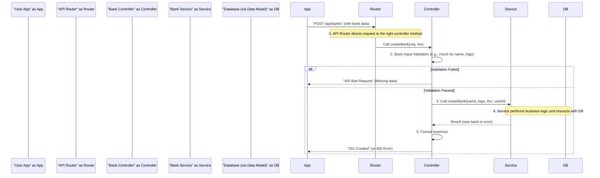

# Chapter 3: API Controllers

Welcome back to the ExpenseMeter tutorial! In our previous chapters, we learned about the inner workings of our application: the [Business Logic Services](01_business_logic_services_.md), which are the "chefs" doing the actual work, and [Data Models (MongoDB Schemas)](02_data_models__mongodb_schemas_.md), which are the "recipe cards" for our data.

But how do requests from your ExpenseMeter app, like "add a new transaction" or "view my monthly budget," actually reach these services? Who takes your order?

That's where **API Controllers** come in!

### The Core Idea: What are API Controllers?

Imagine our ExpenseMeter application's server is like a busy restaurant. You, the user, are the customer. You speak to a **waiter** (or receptionist) to place your order. In our server, the **API Controllers** are exactly like these waiters.

They are the first point of contact for any request coming from your ExpenseMeter app (or any other application that wants to use our API).

Here's what API Controllers do:

1.  **Receive Requests:** They are always listening for incoming requests, like your "add bank" request.
2.  **Understand the Request:** They figure out what you're trying to do (e.g., "You want to create a new bank").
3.  **Perform Basic Checks (Input Validation):** Before passing the order to the kitchen, a good waiter might quickly check if you've provided all the necessary details (e.g., "Did you tell me the bank's name?").
4.  **Delegate Work:** They then hand over the "cooking" (the actual task) to the right [Business Logic Service](01_business_logic_services_.md) (the chef).
5.  **Format and Send Response:** Once the service has done its job, the controller takes the result, wraps it up nicely (usually as a JSON message), and sends it back to your app.

In short, **Controllers act as the interface between the outside world (your app) and our internal [Business Logic Services](01_business_logic_services_.md).** They manage the communication flow without doing the heavy lifting themselves.

### A Practical Example: Creating a New Bank Account

Let's use our familiar example: adding a new bank account to your ExpenseMeter app.

When you tap "Add Bank" on your phone, your app sends a request to our server. This request eventually lands on an API Controller.

Consider the `createBank` method within our `bankController`:

```javascript
// From backend/controllers/bankController.js (simplified)
const bankService = require("../services/bankService"); // Import our "chef" for banks

class BankController {
    async createBank(req, res) { // req = request, res = response
        const bankData = req.body; // Get data sent by the user (name, logo, ifsc)
        const userId = req.body.userId; // Get user ID
        
        // 1. Basic Input Validation: Check if essential data is missing
        if (!bankData.name || !bankData.logo || !bankData.ifsc) {
            return res.status(400).json({ message: "Name, logo and IFSC are required" });
        }
        
        try {
            // 2. Delegate Work: Call the Bank Service (our chef)
            const bank = await bankService.createBank(bankData.name, bankData.logo, bankData.ifsc, userId);
            
            // 3. Format and Send Response: Success!
            res.status(201).json({
                message: "Bank created successfully",
                data: bank // Send back the newly created bank info
            });
        } catch (error) {
            // 4. Format and Send Response: Error!
            res.status(400).json({ message: error.message });
        }
    }
    // ... other methods like getAllBanks, updateBankById
}

module.exports = new BankController();
```

**Explanation of the Code:**

*   `async createBank(req, res)`: This is the specific method in our `BankController` that handles requests to create a new bank.
    *   `req`: This object contains all the information about the incoming request, including the data sent by the user (like bank name, logo, IFSC) in `req.body`.
    *   `res`: This object is what we use to send a response back to the user's app.
*   `const bankData = req.body;`: We extract the bank details that the user sent from the `req.body`.
*   `if (!bankData.name || ...)`: This is our basic input validation. The controller quickly checks if the user provided all the *required* pieces of information (name, logo, IFSC). If not, it sends an error back right away (HTTP status 400 means "Bad Request").
*   `await bankService.createBank(...)`: This is where the controller delegates the actual "work" to our [Business Logic Service](01_business_logic_services_.md). It calls the `createBank` function in `bankService`, passing all the necessary data. The `await` keyword means the controller "waits" for the service to finish before continuing.
*   `res.status(201).json(...)`: If the `bankService` successfully creates the bank, the controller formats a success message and sends it back to the user's app with an HTTP status of `201` (meaning "Created").
*   `catch (error)`: If the `bankService` encounters a problem (e.g., bank already exists), it `throws an Error`. The controller catches this error and sends an appropriate error message back to the user's app (HTTP status `400`).

### How It Works Behind the Scenes (The Server's Reception)

Let's visualize the flow when a user wants to create a bank:



1.  **Request Arrives:** Your ExpenseMeter app sends a request (e.g., "POST /api/banks" with the bank details).
2.  **Routing (Next Chapter!):** An **[API Router](04_api_routing_.md)** (which we'll learn about in the next chapter) intercepts this request and figures out *which* controller and *which method* in that controller should handle it. For adding a bank, it directs the request to `BankController.createBank`.
3.  **Controller Receives:** The `BankController.createBank` method receives the `req` (request) and `res` (response) objects.
4.  **Basic Validation:** The controller quickly checks `req.body` to make sure all immediately necessary information is present. If something basic is missing, it sends a `400 Bad Request` error back to the app.
5.  **Delegation to Service:** If the basic checks pass, the controller calls `bankService.createBank()`. This is like the receptionist telling the chef the order.
6.  **Service Does Work:** The `bankService` (our chef) then performs all the complex business logic (like checking for duplicate names, interacting with the [Data Models (MongoDB Schemas)](02_data_models__mongodb_schemas_.md) to save data).
7.  **Result Back to Controller:** The `bankService` completes its task and returns either the newly created bank object or an error.
8.  **Controller Responds:** The controller takes this result, formats it into a standard JSON message, sets the appropriate HTTP status code (`201` for success, `400` for client-side errors), and sends it back to your app using `res.json()`.

### Why Separate Controllers from Services?

You might notice that both controllers and services perform some kind of validation. So why have both? It's about clear responsibilities!

| API Controllers (The Waiter)                       | [Business Logic Services](01_business_logic_services_.md) (The Chef) |
| :------------------------------------------------- | :------------------------------------------------------------------- |
| **HTTP-aware**: Knows about requests (`req`), responses (`res`), status codes. | **HTTP-agnostic**: Doesn't care about `req` or `res`. Just takes data and returns results. |
| **Route Handling**: First point of contact from external requests. | **Core Logic**: Knows *how* to perform specific tasks.               |
| **Basic Input Validation**: Checks if *all required inputs* are present. | **Business Rule Validation**: Checks if inputs *make sense* according to application rules (e.g., "bank name must be unique"). |
| **Delegates Work**: Calls the appropriate service. | **Performs Work**: Interacts with [Data Models](02_data_models__mongodb_schemas_.md) and applies rules. |
| **Formats Response**: Converts service output into a standard API response (JSON). | **Returns Raw Result**: Gives back the data or error directly to the caller (controller). |

This separation keeps our code clean, organized, and easier to manage. If we decide to use our business logic in a different way (e.g., from a scheduled task instead of an API call), the services can be reused easily without needing the `req` and `res` objects.

### Other Controller Examples

Let's look at a few other methods in different controllers to see how they all follow a similar pattern:

**Getting all categories for a user:**

```javascript
// From backend/controllers/categoryController.js (simplified)
const categoryService = require('../services/categoryService');

class CategoryController {
  async getAllCategories(req, res) {
    try {
      // Get userId from request parameters
      const userId = req.params.userId; 
      if (!userId) {
        return res.status(400).json({ message: 'User ID is required' });
      }
      // Delegate to service
      const categories = await categoryService.getAllCategories(userId);
      // Send success response
      return res.status(200).json({
        message: 'Categories retrieved successfully',
        data: categories
      });
    } catch (error) {
      // Send error response
      return res.status(400).json({ message: error.message });
    }
  }
}
```

**Creating a new budget:**

```javascript
// From backend/controllers/budgetController.js (simplified)
const budgetService = require('../services/budgetService');

class BudgetController {
  async createBudget(req, res) {
    try {
      const { title, amount, category, user_id, start_date, end_date } = req.body;
      
      // Basic validation
      if (!title || user_id === undefined || !category || amount === undefined) {
        return res.status(400).json({ message: 'All fields are required' });
      }
      if (typeof amount !== 'number' || Number.isNaN(amount) || amount < 0) {
        return res.status(400).json({ message: 'Amount must be a positive number' });
      }
      
      // Delegate to service
      const budget = await budgetService.createBudget({ 
        title, amount, category, user_id, start_date, end_date 
      });
      // Send success response
      return res.status(201).json(budget);
    } catch (error) {
      // Send error response
      return res.status(400).json({ message: error.message });
    }
  }
}
```

Notice the consistent structure:
1.  Extract data from `req` (params, body, query).
2.  Perform quick, basic checks.
3.  Call the relevant [Business Logic Service](01_business_logic_services_.md).
4.  Send a formatted response using `res` with an appropriate status code.

### Conclusion

In this chapter, we've learned that **API Controllers** are the "receptionists" or "waiters" of our ExpenseMeter server. They receive requests from your app, perform essential initial checks, and then politely hand off the actual work to the specialized [Business Logic Services](01_business_logic_services_.md). Once the work is done, they make sure to send a clear and properly formatted message back to your app. This layer is crucial for handling communication with the outside world and keeping our application organized.

Now that we know *who* receives the requests, the next logical step is to understand *how* those requests even arrive at the right controller in the first place! In the next chapter, we'll explore **[API Routing](04_api_routing_.md)**.

---

<sub><sup>Generated by [AI Codebase Knowledge Builder](https://github.com/The-Pocket/Tutorial-Codebase-Knowledge).</sup></sub> <sub><sup>**References**: [[1]](https://github.com/gajendranasokkumar/ExpenseMeter/blob/cb7cf86a3b1c26a2af66661d5e1c888aaaf5bdfd/backend/controllers/bankController.js), [[2]](https://github.com/gajendranasokkumar/ExpenseMeter/blob/cb7cf86a3b1c26a2af66661d5e1c888aaaf5bdfd/backend/controllers/budgetController.js), [[3]](https://github.com/gajendranasokkumar/ExpenseMeter/blob/cb7cf86a3b1c26a2af66661d5e1c888aaaf5bdfd/backend/controllers/categoryController.js), [[4]](https://github.com/gajendranasokkumar/ExpenseMeter/blob/cb7cf86a3b1c26a2af66661d5e1c888aaaf5bdfd/backend/controllers/exportController.js), [[5]](https://github.com/gajendranasokkumar/ExpenseMeter/blob/cb7cf86a3b1c26a2af66661d5e1c888aaaf5bdfd/backend/controllers/notificationController.js), [[6]](https://github.com/gajendranasokkumar/ExpenseMeter/blob/cb7cf86a3b1c26a2af66661d5e1c888aaaf5bdfd/backend/controllers/statisticsController.js), [[7]](https://github.com/gajendranasokkumar/ExpenseMeter/blob/cb7cf86a3b1c26a2af66661d5e1c888aaaf5bdfd/backend/controllers/transactionController.js), [[8]](https://github.com/gajendranasokkumar/ExpenseMeter/blob/cb7cf86a3b1c26a2af66661d5e1c888aaaf5bdfd/backend/controllers/userController.js)</sup></sub>