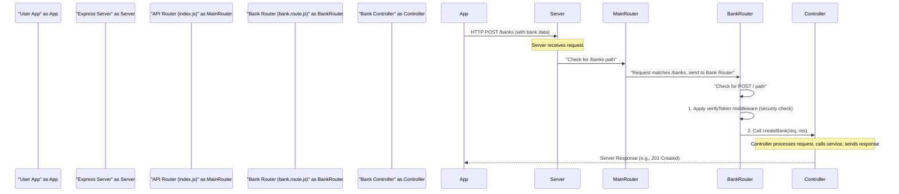

# Chapter 4: API Routing

Welcome back to the ExpenseMeter tutorial! In our last chapter, we met the "waiters" of our server: the [API Controllers](03_api_controllers_.md). They are responsible for receiving requests from your app, doing some initial checks, and then handing off the actual work to our [Business Logic Services](01_business_logic_services_.md).

But there's still a missing piece in our server's restaurant analogy. Imagine you walk into a very large restaurant with many different waiters, all specializing in different types of orders (e.g., one for drinks, one for appetizers, one for main courses). How does the hostess or front desk know *which* waiter to send you to for your specific request?

That's where **API Routing** comes in!

### The Core Idea: What is API Routing?

**API Routing** acts like the traffic controller or the restaurant's hostess. When your ExpenseMeter app sends a request to our backend server, it needs to go to the correct [API Controller](03_api_controllers_.md) to be processed. The router is the system that makes sure this happens.

It looks at two main things from your app's request:

1.  **The URL (Web Address):** This is like the specific section of the restaurant you want to go to. For example, `/banks` might be for managing bank accounts, and `/transactions` for transactions.
2.  **The HTTP Method (Action Type):** This is like *what* you want to do in that section.
    *   `POST`: Usually means "create something new" (e.g., create a new bank).
    *   `GET`: Usually means "get information" (e.g., get all your banks).
    *   `PUT`: Usually means "update something existing" (e.g., update a bank's details).
    *   `DELETE`: Usually means "remove something" (e.g., delete a bank).

The router matches the incoming URL and HTTP method to a specific "road" (code path) and directs the request to the appropriate "handler" (a method in an [API Controller](03_api_controllers_.md)) to process it.

### A Practical Example: Adding a New Bank

Let's revisit our "add a new bank" example. When you tap "Add Bank" in your ExpenseMeter app:

*   Your app sends a `POST` request to the URL `/api/banks`.
*   The API Router intercepts this request.
*   It sees `POST` and `/api/banks`, and knows exactly which [API Controller](03_api_controllers_.md) method (specifically, `bankController.createBank`) should handle it.
*   It then passes the request details to `bankController.createBank`.

### Defining Routes with Express.js

In ExpenseMeter, we use Node.js with the Express.js framework. Express makes defining routes very straightforward. We typically create separate files for routes related to different parts of our application (e.g., `bank.route.js` for banks, `user.route.js` for users).

Let's look at a simplified route definition for our bank functionality:

```javascript
// File: backend/routes/bank.route.js
const express = require('express');
const router = express.Router(); // 1. Create a new router
const bankController = require('../controllers/bankController'); // 2. Import the bank controller
const verifyToken = require('../middlewares/VerifyToken'); // 3. Import security middleware

// Define routes for banks
router.post('/all', verifyToken, bankController.getAllBanks); // For fetching all banks (even though it's POST, it fetches data)
router.post('/', verifyToken, bankController.createBank); // 4. Define the POST route for /banks
router.get('/:id/user/:userId', verifyToken, bankController.getBankById); // For getting a specific bank
// ... other bank-related routes

module.exports = router; // Make this router available to other parts of the app
```

**Explanation:**

1.  `const router = express.Router();`: We create a special "mini-app" or "mini-router" just for bank-related routes. This keeps our code modular.
2.  `const bankController = require('../controllers/bankController');`: We import our [Bank Controller](03_api_controllers_.md) so that our routes can direct requests to its methods.
3.  `const verifyToken = require('../middlewares/VerifyToken');`: This is a security check! Before any bank request is processed, `verifyToken` runs to ensure the user is logged in and authorized. We'll learn more about this in [Chapter 5: Authentication & Security Middleware](05_authentication___security_middleware_.md).
4.  `router.post('/', verifyToken, bankController.createBank);`: This is our main "add bank" route!
    *   `router.post()`: Says "This route handles `POST` requests."
    *   `/`: This is the *path relative to the router's base*. We'll see how it becomes `/api/banks` soon.
    *   `verifyToken`: The security middleware runs first.
    *   `bankController.createBank`: If `verifyToken` passes, the request is then handed to the `createBank` method in our `bankController`.

This `bank.route.js` file essentially tells our backend: "If you get a `POST` request at the path for banks, first check `verifyToken`, then run `bankController.createBank`."

### Bringing All Routes Together

Now that we have individual route files for banks, budgets, transactions, and users, how do they all connect to the main server?

We have a central file, `backend/routes/index.js`, which acts as the master route manager. It imports all the individual route files and registers them with specific base paths.

```javascript
// File: backend/routes/index.js (simplified)
const express = require('express');
const router = express.Router(); // Main application router

const userRoutes = require('./user.route');
const transactionRoutes = require('./transaction.route');
const bankRoutes = require('./bank.route'); // Import our bank routes
const budgetRoutes = require('./budget.route');
// ... other route imports

router.get('/', homeController.getHome); // A simple route for the home page

router.use('/users', userRoutes); // All user routes will start with /users
router.use('/transactions', transactionRoutes); // All transaction routes will start with /transactions
router.use('/banks', bankRoutes); // All bank routes will start with /banks
router.use('/budgets', budgetRoutes); // All budget routes will start with /budgets
// ... more route mappings

module.exports = router;
```

**Explanation:**

*   `router.use('/banks', bankRoutes);`: This line is key! It tells the main application router: "For any request that starts with `/banks`, use the `bankRoutes` (which we defined in `backend/routes/bank.route.js`) to handle it."
*   This is how `router.post('/')` in `bank.route.js` magically becomes `POST /banks` when combined with the main router.

So, if your app sends `POST /banks`, the `index.js` router sees `/banks` and directs it to `bankRoutes`. Then, `bankRoutes` (from `bank.route.js`) sees the remaining `/` and matches it to `router.post('/')`, sending the request to `bankController.createBank`.

### How It Works Behind the Scenes (The Server's Traffic Control)

Let's visualize the journey of a request from your app to the correct controller:



1.  **Request from App**: Your ExpenseMeter app sends a `POST` request to `/banks` with new bank information.
2.  **Server Receives**: The Express server receives this incoming request.
3.  **Main Router**: The server passes the request to the `MainRouter` (defined in `backend/routes/index.js`). The `MainRouter` sees `router.use('/banks', bankRoutes);` and knows that any request starting with `/banks` should be handled by the `BankRouter`.
4.  **Bank Router**: The `BankRouter` (from `backend/routes/bank.route.js`) then takes over. It looks for a `POST` route that matches the remaining part of the URL (which is just `/`). It finds `router.post('/', verifyToken, bankController.createBank);`.
5.  **Middleware & Controller**:
    *   First, the `verifyToken` middleware runs to authenticate the user.
    *   If `verifyToken` passes, the request is finally directed to the `bankController.createBank` method.
6.  **Controller Processes**: The [Bank Controller](03_api_controllers_.md) then does its job: validates input, calls the [Bank Service](01_business_logic_services_.md), and sends a response back to your app.

### Why Separate API Routing?

Imagine trying to manage all these paths and methods in one giant file! It would be a nightmare. Separating routing into distinct files offers several advantages:

| Without API Routing (Monolithic File)                  | With API Routing (ExpenseMeter Approach)            |
| :----------------------------------------------------- | :-------------------------------------------------- |
| **Messy**: All routes in one huge file.               | **Organized**: Routes grouped by functionality (e.g., `bank.route.js`). |
| **Hard to Find**: Difficult to locate a specific route. | **Easy to Navigate**: Logical file structure.       |
| **Collaboration Issues**: Conflicts when multiple developers work on routes. | **Smoother Collaboration**: Developers work on separate files. |
| **Scalability**: Becomes unmanageable as the app grows. | **Scalable**: Easily add new features/routes without disrupting existing ones. |
| **Reusability**: Routes cannot be easily reused.       | **Modular**: Individual routers can be reused if needed. |

By using API Routing, our ExpenseMeter backend stays organized, maintainable, and easy to expand as we add more features.

### Conclusion

In this chapter, we've learned that **API Routing** is the essential traffic controller of our ExpenseMeter backend. It's responsible for efficiently directing incoming requests (based on URL and HTTP method) to the correct [API Controllers](03_api_controllers_.md) for processing. By organizing our routes into modular files, we keep our application structured and scalable.

Now that we understand how requests are routed to controllers, we'll dive into the important security checks that happen *before* the controller even gets the request. In the next chapter, we'll explore **[Authentication & Security Middleware](05_authentication___security_middleware_.md)**.

---

<sub><sup>Generated by [AI Codebase Knowledge Builder](https://github.com/The-Pocket/Tutorial-Codebase-Knowledge).</sup></sub> <sub><sup>**References**: [[1]](https://github.com/gajendranasokkumar/ExpenseMeter/blob/cb7cf86a3b1c26a2af66661d5e1c888aaaf5bdfd/README.md), [[2]](https://github.com/gajendranasokkumar/ExpenseMeter/blob/cb7cf86a3b1c26a2af66661d5e1c888aaaf5bdfd/backend/routes/bank.route.js), [[3]](https://github.com/gajendranasokkumar/ExpenseMeter/blob/cb7cf86a3b1c26a2af66661d5e1c888aaaf5bdfd/backend/routes/budget.route.js), [[4]](https://github.com/gajendranasokkumar/ExpenseMeter/blob/cb7cf86a3b1c26a2af66661d5e1c888aaaf5bdfd/backend/routes/category.route.js), [[5]](https://github.com/gajendranasokkumar/ExpenseMeter/blob/cb7cf86a3b1c26a2af66661d5e1c888aaaf5bdfd/backend/routes/export.route.js), [[6]](https://github.com/gajendranasokkumar/ExpenseMeter/blob/cb7cf86a3b1c26a2af66661d5e1c888aaaf5bdfd/backend/routes/index.js), [[7]](https://github.com/gajendranasokkumar/ExpenseMeter/blob/cb7cf86a3b1c26a2af66661d5e1c888aaaf5bdfd/backend/routes/notification.route.js), [[8]](https://github.com/gajendranasokkumar/ExpenseMeter/blob/cb7cf86a3b1c26a2af66661d5e1c888aaaf5bdfd/backend/routes/statistics.route.js), [[9]](https://github.com/gajendranasokkumar/ExpenseMeter/blob/cb7cf86a3b1c26a2af66661d5e1c888aaaf5bdfd/backend/routes/transaction.route.js), [[10]](https://github.com/gajendranasokkumar/ExpenseMeter/blob/cb7cf86a3b1c26a2af66661d5e1c888aaaf5bdfd/backend/routes/user.route.js)</sup></sub>