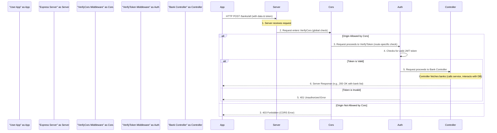

# Chapter 5: Authentication & Security Middleware

Welcome back, ExpenseMeter adventurer! In our last chapter, we uncovered the clever system of [API Routing](04_api_routing_.md) that directs incoming requests to the right [API Controllers](03_api_controllers_.md). The router acts like a traffic controller, making sure your "add bank" request goes to the `bankController`, and your "view transactions" request goes to the `transactionController`.

But imagine our server is a secure building. Even if you know which department (controller) to go to, you can't just walk in, right? You need to pass through security checks at the entrance! What if someone unauthorized tries to access your private financial data? Or what if a harmful website tries to trick your browser into sending requests to our server?

This is where **Authentication & Security Middleware** steps in.

### The Core Idea: Our Server's Security Guards

Think of **Middleware** as special "security guards" or "checkpoints" that every request must pass through *before* it reaches its final destination (the [API Controller](03_api_controllers_.md)). These guards perform important checks to ensure safety and authorization.

In ExpenseMeter, we have two main types of security guards:

1.  **`VerifyToken` (The ID Card Checker)**: This guard checks if the person making the request (you, the user) has a valid "ID card" (a **JWT token**) and is actually logged in. If you don't have one, or if it's fake/expired, you're not getting in! This prevents unauthorized access to your private data.
2.  **`VerifyCors` (The Trusted Entrance Monitor)**: This guard ensures that requests only come from *trusted sources*. Imagine your ExpenseMeter mobile app is the only trusted entrance. `VerifyCors` prevents other, potentially malicious, websites from making requests to our server on your behalf, protecting against common web vulnerabilities.

In essence, these middleware functions act as critical gates that protect our server from unwanted access and ensure that only legitimate, authorized requests proceed to our [API Controllers](03_api_controllers_.md) and [Business Logic Services](01_business_logic_services_.md).

### A Practical Example: Viewing Your Banks Securely

Let's revisit the idea of viewing your bank accounts. When you open the "Banks" section in your ExpenseMeter app:

*   Your app sends a request to our server (e.g., `POST /banks/all`).
*   Before this request even thinks about reaching the `bankController.getAllBanks` method, it must pass through our security middleware:
    *   First, `VerifyCors` checks if the request is coming from our legitimate ExpenseMeter app.
    *   Then, `VerifyToken` checks if *you* (the user) are logged in and have a valid token (ID card).
*   Only if both guards give the green light does the request proceed to the `bankController` to fetch your bank data.

### Key Concept 1: `VerifyToken` (Authentication Middleware)

Authentication is about proving who you are. When you log in to ExpenseMeter, our server gives you a special digital "ID card" called a **JSON Web Token (JWT)**. Your app then includes this token with almost every request you make.

The `VerifyToken` middleware's job is to:

1.  **Look for the ID card**: Check if the incoming request has a JWT token attached.
2.  **Validate the ID card**: Decrypt the token and verify its signature to ensure it hasn't been tampered with and hasn't expired.
3.  **Grant Access**: If the token is valid, it allows the request to proceed. It might also extract some user information (like your user ID or role) from the token and attach it to the request so that later parts of the application know who is making the request.
4.  **Deny Access**: If no token is present, or if it's invalid, it immediately stops the request and sends an "Unauthorized" error back to your app.

Here's a simplified look at the `VerifyToken` middleware:

```javascript
// File: backend/middlewares/VerifyToken.js (highly simplified for tutorial)
const jwt = require('jsonwebtoken'); // Library to work with JWTs

const verifyToken = (req, res, next) => {
  const token = req.headers['authorization']; // Get "Bearer <token>" from request header
  if (!token) return res.status(403).json({ message: 'No token provided' });

  try {
    // Extract the actual token (after "Bearer ") and verify its signature
    const decoded = jwt.verify(token.split(" ")[1], "YOUR_JWT_SECRET"); 
    req.user = decoded.role; // Store user's role from token for later use
    next(); // Token is valid, let the request continue to the controller!
  } catch (err) {
    return res.status(401).json({ message: 'Invalid Token' }); // Token invalid/expired
  }
};

module.exports = verifyToken;
```
**Explanation:**
*   `req.headers['authorization']`: Requests from your app send the JWT in a special header called `Authorization`, usually formatted as `Bearer YOUR_TOKEN_HERE`.
*   `if (!token) ...`: If no `Authorization` header is found, access is immediately denied (`403 Forbidden`).
*   `jwt.verify(token.split(" ")[1], "YOUR_JWT_SECRET")`: This is the core check. `token.split(" ")[1]` extracts the actual token string. The `jwt.verify` function uses a secret key (stored in `process.env.JWT_SECRET` in a real app, but simplified to a placeholder here) to ensure the token is authentic and not expired.
*   `req.user = decoded.role;`: If the token is valid, we can extract information (like `role` or `userId`) and attach it to the `req` object. This way, subsequent parts of the application (like our [API Controllers](03_api_controllers_.md)) know who the authenticated user is without needing to re-verify the token.
*   `next();`: This important function tells Express to pass the request to the *next* middleware in line, or to the final [API Controller](03_api_controllers_.md) method.
*   `catch (err)`: If `jwt.verify` fails (e.g., wrong secret, expired token), an error is caught, and an "Invalid Token" response (`401 Unauthorized`) is sent.

### How `VerifyToken` is Used in Routing

Remember our [API Routing](04_api_routing_.md) from the last chapter? We simply "insert" our `verifyToken` middleware into the route definition:

```javascript
// File: backend/routes/bank.route.js (simplified)
const express = require('express');
const router = express.Router();
const bankController = require('../controllers/bankController');
const verifyToken = require('../middlewares/VerifyToken'); // Import our ID card checker!

// Route to get all banks for the authenticated user
router.post('/all', verifyToken, bankController.getAllBanks);

// Route to create a new bank for the authenticated user
router.post('/', verifyToken, bankController.createBank);

module.exports = router;
```
**Explanation:**
The `verifyToken` function is placed *before* `bankController.getAllBanks` (or `createBank`). This means when a request for `/banks/all` comes in, it will **first** run `verifyToken`. If `verifyToken` passes (`next()` is called), **then** `bankController.getAllBanks` will execute. If `verifyToken` fails, the request stops there and an error is sent back to the user.

### Key Concept 2: `VerifyCors` (Security Middleware for Trusted Origins)

**CORS** stands for **Cross-Origin Resource Sharing**. It's a security feature built into web browsers that prevents web pages from making requests to a server in a different domain than the one the web page itself came from. This protects users from malicious websites trying to steal data or perform actions on other sites they are logged into.

The `VerifyCors` middleware's job is to:

1.  **Check the origin**: When a request comes from a web browser, it includes an "Origin" header (the domain of the website making the request). `VerifyCors` looks at this.
2.  **Compare to trusted list**: It compares the request's origin against a list of `allowedOrigins` (e.g., the URL where your ExpenseMeter frontend app is hosted).
3.  **Allow or Block**: If the origin is in the allowed list, `VerifyCors` adds special headers to the response, telling the browser "It's okay, you can accept this response." If the origin is *not* in the allowed list, it typically blocks the request entirely, sending an error.

Here's a simplified version of `VerifyCors` in ExpenseMeter:

```javascript
// File: backend/middlewares/VerifyCors.js (highly simplified for tutorial)
const cors = require("cors"); // Express middleware for CORS

const allowedOrigins = [
  "http://localhost:3000", // Your local development app
  "http://localhost:5173", // Another common dev port
  // In production, add your deployed frontend URL here!
];

const customCorsMiddleware = cors({
  origin: (origin, callback) => {
    // If the request has no origin (e.g., from Postman, or same-origin) or is allowed
    if (!origin || allowedOrigins.includes(origin)) {
      callback(null, true); // Allow the request
    } else {
      // For tutorial simplicity, we'll allow all for now.
      // In a real production setup, this would be:
      // callback(new Error("Not allowed by CORS")); // Block untrusted origins
      callback(null, true); // Still allow for development ease
    }
  },
  methods: "GET, POST, PUT, DELETE, PATCH, OPTIONS", // HTTP methods allowed
  allowedHeaders: "Content-Type, Authorization", // Headers allowed
});

module.exports = customCorsMiddleware;
```
**Explanation:**
*   `const cors = require("cors");`: We use a popular `cors` library for Express to handle CORS simply.
*   `allowedOrigins`: This array holds the list of trusted domain names (origins) that are allowed to make requests to our server.
*   `origin: (origin, callback) => { ... }`: This is a custom function to determine if an incoming `origin` is allowed.
    *   `if (!origin || allowedOrigins.includes(origin))`: If the request has no origin (e.g., a direct server-to-server request, or a request from the same server itself) OR if the `origin` is in our `allowedOrigins` list, we call `callback(null, true)` to allow it.
    *   `else callback(new Error("Not allowed by CORS"));`: **Crucially**, in a real production environment, if an origin is *not* trusted, you would send an error to block the request. For beginner tutorial simplicity, the ExpenseMeter project's code snippet sometimes defaults to `callback(null, true)` even for disallowed origins to make local testing easier, but remember the security implication!
*   `methods` and `allowedHeaders`: These specify which HTTP methods (GET, POST, etc.) and which headers (like `Content-Type` and `Authorization`) are allowed in cross-origin requests.

### How `VerifyCors` is Applied

Unlike `VerifyToken` which is applied to specific routes, `VerifyCors` is usually applied globally to the entire Express application in `backend/index.js` to protect *all* incoming requests:

```javascript
// File: backend/index.js (simplified snippet)
const express = require('express');
const app = express(); // Our main Express application
const verifyCors = require("./middlewares/VerifyCors"); // Import our CORS guard

// ... other imports and initial setup

app.use(express.json()); // Middleware to parse JSON request bodies
app.use(verifyCors); // Apply CORS protection globally to all requests!

// ... database connection setup

// Map all our API routes
app.use('/', require('./routes')); // All defined API routes

const PORT = process.env.PORT || 3000;
app.listen(PORT, () => console.log(`Server running on port ${PORT}`));
```
**Explanation:**
*   `app.use(verifyCors);`: By using `app.use()` *before* our routes are defined, we ensure that *every single request* to our ExpenseMeter server first passes through the `verifyCors` middleware. This makes sure that no matter which route is requested, it's always checked for trusted origins.

### How It Works Behind the Scenes (The Server's Security Checkpoints)

Let's visualize the journey of a request that wants to view your banks, showing both security guards in action:



1.  **Request from App**: Your ExpenseMeter app sends a `POST` request to `/banks/all`.
2.  **Global CORS Check**: The `Express Server` immediately passes this request to the `VerifyCors` middleware (because `app.use(verifyCors)` is defined early). If the `Origin` is not allowed, `VerifyCors` stops the request and sends a `403 Forbidden` error.
3.  **Routing & Token Check**: If `VerifyCors` passes, the request is then handed to the [API Router](04_api_routing_.md). The router matches the `POST /banks/all` route, which specifies `verifyToken` as the *next* step. `VerifyToken` checks for a valid JWT. If the token is missing or invalid, it sends a `401 Unauthorized` error.
4.  **Controller Execution**: Only if `VerifyToken` passes, the request finally reaches the `bankController.getAllBanks` method.
5.  **Service & Database**: The [Bank Controller](03_api_controllers_.md) then calls the [Bank Service](01_business_logic_services_.md), which interacts with the database (via [Data Models](02_data_models__mongodb_schemas_.md)) to fetch your bank accounts.
6.  **Response**: The controller formats the response and sends it back to your app.

### Why Use Authentication & Security Middleware?

| Without Middleware (Risky!)                                  | With Middleware (ExpenseMeter Approach)                      |
| :----------------------------------------------------------- | :----------------------------------------------------------- |
| **Vulnerable to Attacks**: No protection against unauthorized access or cross-origin issues. | **Secure**: Requests are authenticated and origins are validated. |
| **Repetitive Code**: Every controller method needs to check authentication. | **Clean Code**: Security checks are centralized in reusable middleware. |
| **Inconsistent Security**: Easy to forget a check in one place. | **Consistent Security**: Checks are applied uniformly.        |
| **Hard to Maintain**: Updating security rules means changing many files. | **Easy to Update**: Change security logic in one middleware file. |
| **Poor User Experience**: Unauthorized users might see sensitive data. | **Controlled Access**: Users only see what they're allowed to. |

By using Authentication & Security Middleware, our ExpenseMeter backend is like a well-guarded fortress, ensuring that your financial data is protected and only accessible to you from trusted sources.

### Conclusion

In this chapter, we've explored the crucial role of **Authentication & Security Middleware** in ExpenseMeter. These "security guards" (`VerifyToken` and `VerifyCors`) act as essential checkpoints, ensuring that only authenticated users from trusted applications can access our server's resources. This layered security approach is fundamental to building a robust and trustworthy application, protecting sensitive financial data from unauthorized access and common web vulnerabilities.

With our security in place, it's time to bring all the pieces together and start our server! In the next chapter, we'll dive into [Server Initialization](06_server_initialization_.md).

---

<sub><sup>Generated by [AI Codebase Knowledge Builder](https://github.com/The-Pocket/Tutorial-Codebase-Knowledge).</sup></sub> <sub><sup>**References**: [[1]](https://github.com/gajendranasokkumar/ExpenseMeter/blob/cb7cf86a3b1c26a2af66661d5e1c888aaaf5bdfd/README.md), [[2]](https://github.com/gajendranasokkumar/ExpenseMeter/blob/cb7cf86a3b1c26a2af66661d5e1c888aaaf5bdfd/backend/index.js), [[3]](https://github.com/gajendranasokkumar/ExpenseMeter/blob/cb7cf86a3b1c26a2af66661d5e1c888aaaf5bdfd/backend/middlewares/VerifyCors.js), [[4]](https://github.com/gajendranasokkumar/ExpenseMeter/blob/cb7cf86a3b1c26a2af66661d5e1c888aaaf5bdfd/backend/middlewares/VerifyToken.js)</sup></sub>