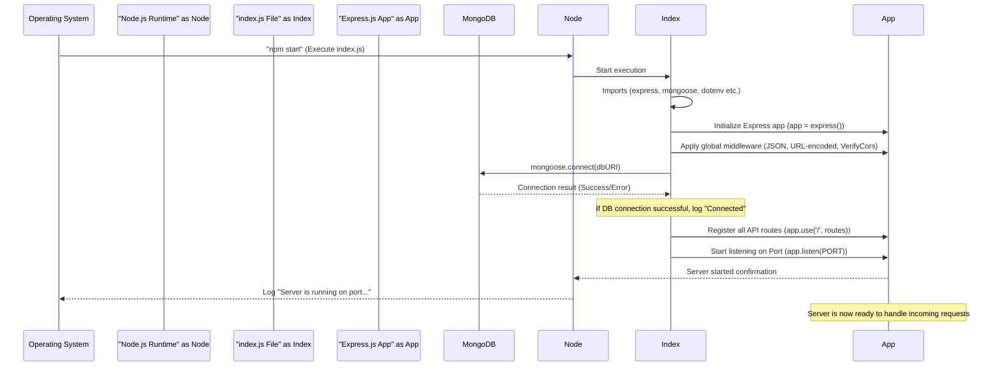

# Chapter 6: Server Initialization

Welcome back, future ExpenseMeter master! In our last chapter, we set up robust security checkpoints with [Authentication & Security Middleware](05_authentication___security_middleware_.md) to protect our server. We learned how requests are routed to the correct "departments" ([API Controllers](03_api_controllers_.md)) after passing security.

But before any of these requests can be processed, before any "waiter" or "chef" can start working, our entire server application needs to be brought to life! It needs to be **initialized**.

### The Core Idea: Setting Up the Server's Office

Imagine our ExpenseMeter backend is like a brand new office building. Before employees (like our [Business Logic Services](01_business_logic_services_.md) and [API Controllers](03_api_controllers_.md)) can start working, the office manager needs to do a lot of setup:

*   **Build the office structure**: Get the basic framework in place.
*   **Set up communication channels**: Install phones, internet, mailboxes.
*   **Hire security**: Place guards at the entrance.
*   **Connect to essential resources**: Link up to the main data archives (our database).
*   **Create internal directories**: Map out where each department ([API Controller](03_api_controllers_.md)) is located.
*   **Finally, open the doors for business!**

**Server Initialization** is exactly this process for our ExpenseMeter application. It involves the main `backend/index.js` file, which is like the **office manager's checklist**. This file configures the basic server application, connects to our database, sets up global security, registers all the "departments" (our [API Routing](04_api_routing_.md)), and ultimately tells the server to start listening for incoming requests. This ensures everything is ready from the moment the server starts running.

### The Server's Blueprint: `backend/index.js`

In ExpenseMeter, all the magic of server initialization happens in a single file: `backend/index.js`. This is the entry point for our entire backend application. When you run `npm start` in the `backend` folder, this is the file that gets executed first.

Let's walk through the key steps in this file, which bring our server to life.

### Key Steps in Server Initialization

#### 1. Setting Up the Express Application

First, we need to bring in the main building blocks. Express.js is our framework for building the web server.

```javascript
// File: backend/index.js (simplified)
const express = require('express'); // 1. Bring in Express, our server builder
const app = express(); // 2. Create our Express application (the office building)

// ... rest of the setup
```
**Explanation:**
1.  `const express = require('express');`: This line imports the `express` library. Think of `express` as the construction company that provides all the tools to build our web server.
2.  `const app = express();`: This line creates an actual Express application instance, `app`. This `app` variable now represents our server – our "office building" – which we will configure and use to handle requests.

#### 2. Configuring Data Handling (Body Parsers)

Our server needs to understand different kinds of data that come in with requests. For example, when you "add a bank," your app sends bank details as JSON.

```javascript
// File: backend/index.js (simplified)
// ... imports and app = express()

app.use(express.json({ limit: '15mb' })); // 1. Understands JSON data
app.use(express.urlencoded({ limit: '15mb', extended: true })); // 2. Understands URL-encoded data

// ... rest of the setup
```
**Explanation:**
1.  `app.use(express.json(...));`: This line adds a middleware that tells our Express app to automatically understand and process incoming request bodies that are in **JSON** format. This is crucial for most of our API requests (like creating a transaction or budget). The `limit` option helps handle larger data, like if you're uploading an image.
2.  `app.use(express.urlencoded(...));`: This is similar, but it helps our app understand data sent in **URL-encoded** format, which is common for traditional web forms.

These are like setting up specialized mailboxes in our office that can automatically open and read different types of incoming mail.

#### 3. Applying Global Security (CORS)

Before any request goes to its destination, we need global security checks. Remember `VerifyCors` from [Chapter 5: Authentication & Security Middleware](05_authentication___security_middleware_.md)? It ensures requests come from trusted sources.

```javascript
// File: backend/index.js (simplified)
// ... imports and app = express()
const verifyCors = require("./middlewares/VerifyCors"); // 1. Import our CORS security guard

// ... body parsers

app.use(verifyCors); // 2. Apply CORS protection globally to all requests!

// ... rest of the setup
```
**Explanation:**
1.  `const verifyCors = require("./middlewares/VerifyCors");`: We import our `verifyCors` middleware.
2.  `app.use(verifyCors);`: By using `app.use()` with `verifyCors` *before* we define any routes, we ensure that **every single request** that comes into our ExpenseMeter server first passes through this security check. This is like placing a security guard at the main entrance of our office building.

#### 4. Connecting to the Database

Our ExpenseMeter app is useless without data! We need to connect our server to our MongoDB database. This is where `mongoose` comes in.

```javascript
// File: backend/index.js (simplified)
// ... imports and app = express()
const mongoose = require('mongoose'); // 1. Bring in Mongoose
require('dotenv').config(); // Load environment variables (like DB connection string)

// ... body parsers and verifyCors

const dbURI = process.env.NODE_ENV === "production"
  ? process.env.MONGODB_URI_PRODUCTION
  : process.env.MONGODB_URI_LOCAL; // 2. Choose DB URI based on environment

mongoose.connect(dbURI) // 3. Connect to MongoDB
  .then(() => console.log("✅ Connected to MongoDB"))
  .catch((err) => {
    console.error("MongoDB connection error:", err);
  });

// ... rest of the setup
```
**Explanation:**
1.  `const mongoose = require('mongoose');`: This imports `mongoose`, the tool that helps our Node.js application easily talk to MongoDB.
2.  `require('dotenv').config();`: This line loads configuration variables (like database connection strings and JWT secrets) from a special `.env` file. We use different database links for `development` (local machine) and `production` (live server) environments.
3.  `mongoose.connect(dbURI)`: This is the critical line that establishes the connection to our MongoDB database. The `.then()` part runs if the connection is successful, logging a success message. The `.catch()` part handles any errors during connection, logging a helpful error message.
    This is like wiring up our office building to its central data archives.

#### 5. Registering All API Routes

Our server now has a body, understands data, and is secure. Next, it needs to know where to direct incoming requests. This is handled by registering our [API Routing](04_api_routing_.md).

```javascript
// File: backend/index.js (simplified)
// ... imports and app = express()
const routes = require('./routes'); // 1. Import our main router (traffic controller)

// ... previous setup (body parsers, cors, db connection)

app.use('/', routes); // 2. Tell the app to use all our defined API routes

// ... error handling and server start
```
**Explanation:**
1.  `const routes = require('./routes');`: This line imports the main router file (`backend/routes/index.js`), which we discussed in [Chapter 4: API Routing](04_api_routing_.md). This `routes` object acts as the central traffic controller for all our API endpoints.
2.  `app.use('/', routes);`: This line tells our Express `app` to use all the routes defined in our `routes` object. The `/` means that these routes will handle requests starting from the root of our application's URL. For example, if `routes` defines a path `/banks`, it becomes accessible as `/banks` on our server. This is like placing a directory board at the entrance, guiding visitors to the correct department.

#### 6. Starting Scheduled Background Tasks (Briefly)

For advanced features like automated reports or notifications, we might have scheduled tasks running in the background. If the server is in "production" mode, we start these tasks.

```javascript
// File: backend/index.js (simplified)
// ... imports and app = express()
const job = require("./utils/cron"); // Import our cron job scheduler

// ... previous setup

if (process.env.NODE_ENV === "production")
  job.start(); // Start background tasks ONLY in production

// ... rest of the setup
```
**Explanation:**
This snippet checks if the server is running in `production` mode (meaning it's live for users). If so, it starts any scheduled background tasks (like generating daily reports) defined in `utils/cron.js`. This is like telling some employees to start their routine daily tasks at a specific time, but only when the office is fully operational for real clients. (We will cover [Scheduled Tasks (Cron Jobs)](08_scheduled_tasks__cron_jobs__.md) in a later chapter).

#### 7. Opening for Business (Starting the Server)

Finally, after all the setup, our server needs to start listening for incoming requests.

```javascript
// File: backend/index.js (simplified)
// ... all previous setup including routes and error handling

const PORT = process.env.PORT || 3000; // 1. Get the port number
const HOST = process.env.HOST || "0.0.0.0"; // 2. Get the host address
app.listen(PORT, HOST, () => { // 3. Start the server!
  console.log(`Server is running on port ${PORT}`);
});
```
**Explanation:**
1.  `const PORT = process.env.PORT || 3000;`: This line determines which "door number" (port) our server will listen on. It first tries to use a `PORT` environment variable (useful for cloud deployments) and defaults to `3000` if not specified.
2.  `const HOST = process.env.HOST || "0.0.0.0";`: This determines which network interface the server listens on. `0.0.0.0` means it will listen on all available network interfaces, making it accessible from other devices on the network or from the internet.
3.  `app.listen(PORT, HOST, () => { ... });`: This is the ultimate command that starts our Express server. It makes the server listen for incoming HTTP requests on the specified `PORT` and `HOST`. The function passed as the third argument runs once the server successfully starts, printing a confirmation message to our console.
    This is the moment our "office doors" officially open for clients!

### How It All Comes Together (The Server's Startup Sequence)

When you run `npm start` for the ExpenseMeter backend, here's a simplified sequence of what happens:



1.  **Start Command**: You run `npm start`, which tells the Operating System to execute Node.js, specifically the `backend/index.js` file.
2.  **Node.js Executes `index.js`**: Node.js starts running the `index.js` code.
3.  **Imports & App Creation**: All necessary libraries (Express, Mongoose, etc.) are imported, and the main `app` Express instance is created.
4.  **Global Middleware Setup**: The `express.json()`, `express.urlencoded()`, and `verifyCors` middleware are applied globally, setting up basic data handling and security for all requests.
5.  **Database Connection**: Mongoose attempts to connect to the MongoDB database using the configured URI. A success or error message is logged.
6.  **Route Registration**: All the API routes (defined in `backend/routes/index.js` and its sub-files) are registered with the Express `app`.
7.  **Server Listens**: Finally, `app.listen()` is called, and the server starts listening for incoming network requests on the specified port. A message is logged to the console confirming that the server is running.
8.  **Ready for Requests**: The server is now fully initialized and actively waiting to receive and process requests from your ExpenseMeter mobile app or any other client!

### Why This Initialization Structure?

You might wonder why we have all these `app.use()` calls and a specific order. It's all about making our server robust, organized, and scalable.

| Without Proper Initialization (Messy)                         | With Proper Initialization (ExpenseMeter Approach)            |
| :------------------------------------------------------------ | :------------------------------------------------------------ |
| **Chaos**: No clear order of operations, fragile setup.       | **Orderly**: Clear, sequential setup of server components.    |
| **Inconsistent**: Some requests might bypass critical middleware. | **Consistent**: Global middleware (like CORS) applies to *all* requests. |
| **Error-prone**: Hard to debug startup issues.                 | **Reliable**: Clear error handling for database connection.    |
| **Security Risks**: Missing security middleware can leave holes. | **Secure**: Global security applied early.                     |
| **Difficult to Scale**: Hard to add new features or deploy.     | **Scalable**: Modular setup, easy to add/remove components.    |
| **Manual Setup**: Need to connect DB, define routes every time. | **Automated Setup**: All done by `index.js` on startup.        |

By carefully structuring our `backend/index.js` file, we ensure that our ExpenseMeter server starts up correctly every time, with all its "departments" and "security checks" in place, ready to handle your financial tracking needs efficiently and securely.

### Conclusion

In this chapter, we've brought our ExpenseMeter backend to life by understanding **Server Initialization**. We explored the `backend/index.js` file, which acts as the server's control center, setting up the Express application, connecting to MongoDB, applying global security middleware, registering all API routes, and finally starting the server to listen for requests. This foundational step ensures our entire application is properly configured and ready for action.

With our server now successfully up and running, we can start thinking about how to extract meaningful insights from all the financial data it processes. In the next chapter, we'll dive into [Statistics & Reporting](07_statistics___reporting_.md).

---

<sub><sup>Generated by [AI Codebase Knowledge Builder](https://github.com/The-Pocket/Tutorial-Codebase-Knowledge).</sup></sub> <sub><sup>**References**: [[1]](https://github.com/gajendranasokkumar/ExpenseMeter/blob/cb7cf86a3b1c26a2af66661d5e1c888aaaf5bdfd/README.md), [[2]](https://github.com/gajendranasokkumar/ExpenseMeter/blob/cb7cf86a3b1c26a2af66661d5e1c888aaaf5bdfd/backend/index.js), [[3]](https://github.com/gajendranasokkumar/ExpenseMeter/blob/cb7cf86a3b1c26a2af66661d5e1c888aaaf5bdfd/backend/package.json)</sup></sub>