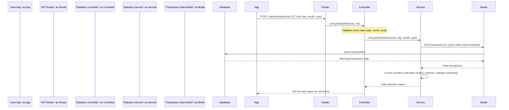

# Chapter 7: Statistics & Reporting

Welcome back to the ExpenseMeter journey! In our last chapter, we successfully brought our server to life through [Server Initialization](06_server_initialization_.md), ensuring all its components are wired up and ready to handle requests. Now, our server is buzzing with your financial data: transactions are being added, budgets are being set, and banks are being registered.

But what's the point of collecting all this data if you can't make sense of it? Simply having a list of transactions isn't enough to truly understand your financial health. This is where **Statistics & Reporting** comes in!

### The Core Idea: Your Personal Financial Analyst

Imagine ExpenseMeter as your dedicated financial analyst. Instead of just listing out every single penny you spent, this analyst takes all your raw transactions and transforms them into easy-to-understand summaries, charts, and trends.

The goal of **Statistics & Reporting** is to answer important questions like:

*   "How much did I spend on food this month?"
*   "What was my total income last year?"
*   "Which bank account do I use the most?"
*   "Am I sticking to my budget for entertainment this week?"
*   "What's my overall financial position (income vs. expense) since I started using the app?"

This abstraction focuses on **gathering and crunching numbers** to give you valuable insights. It helps you **visualize where your money is going**, **manage budgets more effectively**, and **understand your financial habits over time**.

### Key Concepts: Different Views of Your Money

Our ExpenseMeter app offers several types of reports, like different lenses to view your financial data:

1.  **Daily Stats**: A quick snapshot of your income and expenses for a specific day.
2.  **Monthly Summary**: A comprehensive overview for a month, including total income/expense, daily breakdowns, and how your budgets are performing.
3.  **Yearly Stats**: Insights into your financial year, showing monthly income/expense trends and overall yearly totals.
4.  **Total Stats**: An all-time summary of your financial journey, highlighting your best income years, highest expense years, top spending categories, and most-used bank.

Let's see how our app requests these insights.

### How to Get Reports: Using the Statistics API

Just like with adding a bank or transaction, when your ExpenseMeter app needs a financial report, it sends a request to our backend server. This request lands on the **Statistics Controller**, which then asks the **Statistics Service** to perform the calculations.

Let's look at how the app would request your daily spending report:

```javascript
// Imagine this code is in your mobile app (frontend)
const userId = "user123_abc"; // The ID of the logged-in user
const today = new Date();
const currentDay = today.getDate();
const currentMonth = today.getMonth() + 1; // Months are 0-indexed in JS
const currentYear = today.getFullYear();

// This is what the controller (our waiter) receives
// from a request like POST /statistics/daily/user123_abc
// with a JSON body { "day": 15, "month": 7, "year": 2024 }

// Simplified view from backend/controllers/statisticsController.js
class StatisticsController {
  async getDailyStats(req, res) {
    // 1. Get user ID from the URL and date info from the request body
    const { userId } = req.params; // e.g., "user123_abc"
    const { day, month, year } = req.body; // e.g., { day: 15, month: 7, year: 2024 }

    // 2. Basic Validation: Make sure we have all necessary info
    if (!userId || !day || !month || !year) {
      return res.status(400).json({ message: "All date parameters are required" });
    }

    try {
      // 3. Delegate Work: Call the Statistics Service (our analyst/chef)
      const dailyStats = await statisticsService.getDailyStats(userId, day, month, year);

      // 4. Send back the report!
      return res.status(200).json(dailyStats);
    } catch (error) {
      return res.status(400).json({ message: error.message });
    }
  }
}
// ... other functions like getMonthlySummary, getTotalStats

module.exports = new StatisticsController();
```
**Explanation:**
*   The `getDailyStats` method in our `StatisticsController` is triggered when a specific API route is hit (we'll see the route in a moment).
*   It takes the `userId` from the URL (`req.params`) and the `day`, `month`, `year` from the request's body (`req.body`).
*   It performs a quick check to ensure all necessary date information is present.
*   The core task is then handed over to the `statisticsService.getDailyStats` function.
*   Finally, the controller sends back the calculated `dailyStats` report (or an error if something went wrong) to the user's app.

Other statistics reports follow a similar pattern, just calling different functions in the `statisticsService`.

### Behind the Scenes: The Statistics Service (Our Data Analyst)

When your app asks for a report, here's a simplified flow of what happens:



1.  **Request from App**: Your ExpenseMeter app sends a `POST` request to `/statistics/daily/user123` with the date.
2.  **Routing**: The [API Router](04_api_routing_.md) directs this request to the `StatisticsController.getDailyStats` method.
3.  **Controller Receives**: The `StatisticsController` extracts the user ID and date, performs a quick check, and then passes these details to the `statisticsService`.
4.  **Service Crushes Numbers**: This is where the magic happens! The `statisticsService` (our data analyst) takes the user ID and date.
    *   It queries our database (using the [Transaction Data Model](02_data_models__mongodb_schemas__.md)) to fetch *all* transactions for that specific user within that specific day.
    *   Once it has the raw transactions, it loops through them, summing up income and expenses, and categorizing spending.
5.  **Report Back**: The `statisticsService` compiles all these calculations into a neat report and sends it back to the `StatisticsController`.
6.  **Response to App**: The `StatisticsController` then sends this final report back to your app to display to you.

### Diving into the Code: `backend/services/statisticsService.js`

Let's peek into the kitchen of our financial analyst – the `statisticsService.js` file. This is where the actual number-crunching logic lives. It heavily relies on our [Data Models (MongoDB Schemas)](02_data_models__mongodb_schemas_.md), specifically the `TransactionModel`, to get the raw data from the database.

First, the service needs to import the necessary models:
```javascript
// File: backend/services/statisticsService.js
const TransactionModel = require("../models/Transaction.model");
const budgetService = require("../services/budgetService"); // For monthly budgets
const BankModel = require("../models/Bank.model"); // For total stats
```

Now, let's look at the `getDailyStats` function, which is responsible for generating the daily report:

```javascript
// File: backend/services/statisticsService.js (simplified)
exports.getDailyStats = async (userId, day, month, year) => {
  // 1. Define the exact date range for the day
  const startOfDay = new Date(year, month - 1, day, 0, 0, 0, 0);
  const endOfDay = new Date(year, month - 1, day, 23, 59, 59, 999);

  // 2. Fetch all transactions for the user within that day
  const transactions = await TransactionModel.find({
    user_id: userId,
    date: { $gte: startOfDay, $lte: endOfDay },
  }).lean(); // .lean() makes it faster for reading data

  // 3. Initialize counters for income, expense, and category breakdown
  let totalIncome = 0;
  let totalExpense = 0;
  const categoryExpense = {}; // Stores total expense for each category

  // 4. Loop through each transaction and crunch the numbers
  for (const tx of transactions) {
    if (tx.amount > 0) {
      totalIncome += tx.amount; // Add to income if amount is positive
    } else if (tx.amount < 0) {
      totalExpense += Math.abs(tx.amount); // Add to expense if amount is negative
      
      // Update expense for its specific category
      if (!categoryExpense[tx.category]) {
        categoryExpense[tx.category] = 0;
      }
      categoryExpense[tx.category] += Math.abs(tx.amount);
    }
  }

  // 5. Return the calculated statistics
  return {
    totalIncome,
    totalExpense,
    categoryExpense
  };
};
```
**Explanation:**
*   `startOfDay` and `endOfDay`: These lines create `Date` objects that represent the very beginning and very end of the requested day. This helps us precisely query the database.
*   `TransactionModel.find(...)`: This is where the `statisticsService` (our analyst) asks the `TransactionModel` (our recipe card for transactions) to fetch all transactions that belong to the `userId` AND fall within our `startOfDay` and `endOfDay` range.
*   `for (const tx of transactions) { ... }`: After getting the transactions, the service iterates through each one.
    *   If `tx.amount` is positive, it's income.
    *   If `tx.amount` is negative, it's an expense. We use `Math.abs()` to get the positive value of the expense.
    *   The code also tracks expenses per category, building up the `categoryExpense` object.
*   Finally, it returns an object containing the calculated `totalIncome`, `totalExpense`, and `categoryExpense`.

The `statisticsService` also contains other similar functions for `getMonthlySummary`, `getYearlyStats`, and `getTotalStats`. These functions might involve more complex logic, such as:
*   Calling `budgetService` to fetch budgets for the month in `getMonthlySummary`.
*   Using MongoDB's powerful `aggregate` queries (like `$group`, `$sum`, `$sort`) to calculate yearly totals, find top categories, or determine the most used bank in `getTotalStats`. This allows for efficient data analysis directly within the database. For example, to get total income/expense for a range, a helper like `getStatsForRange` is used, which is very similar to `getDailyStats` but takes a flexible start and end date.

### Why Separate Statistics & Reporting?

You might wonder why we dedicate a whole section (service and controller) just for statistics. Here's why it's a great approach:

| Without Dedicated Statistics (Messy)                 | With Statistics & Reporting (ExpenseMeter Approach) |
| :--------------------------------------------------- | :-------------------------------------------------- |
| **No Insights**: Just raw data, hard to understand financial habits. | **Actionable Insights**: Clear reports help manage money better. |
| **Complex Logic Everywhere**: Calculation logic duplicated across the app. | **Centralized Logic**: All reporting calculations in one `statisticsService`. |
| **Slow Performance**: Inefficient queries to generate reports. | **Optimized Queries**: Service can use advanced database features for fast reporting. |
| **Hard to Maintain**: Any change in calculation requires updating many places. | **Easy to Update**: Modify a report in one `statisticsService` function. |
| **Not Reusable**: Reports tied to specific parts of the app. | **Reusable**: Statistics service can be used by different parts of the app or even other apps. |

By dedicating a specific layer to Statistics & Reporting, ExpenseMeter ensures that providing financial insights is efficient, accurate, and easy to maintain, giving you the power to truly understand your money.

### Conclusion

In this chapter, we've explored the crucial role of **Statistics & Reporting** in ExpenseMeter. We learned that this abstraction acts as our personal financial analyst, transforming raw transaction data into valuable insights like daily spending, monthly summaries, yearly trends, and overall financial health. By organizing calculation logic within a dedicated service and exposing it through specific API routes, ExpenseMeter empowers users to visualize and take control of their financial journey.

Now that our server is fully set up and can generate powerful reports, what if we want some of these reports to be created automatically every day or month? In the next chapter, we'll dive into **[Scheduled Tasks (Cron Jobs)](08_scheduled_tasks__cron_jobs_.md)**.

---

<sub><sup>Generated by [AI Codebase Knowledge Builder](https://github.com/The-Pocket/Tutorial-Codebase-Knowledge).</sup></sub> <sub><sup>**References**: [[1]](https://github.com/gajendranasokkumar/ExpenseMeter/blob/cb7cf86a3b1c26a2af66661d5e1c888aaaf5bdfd/README.md), [[2]](https://github.com/gajendranasokkumar/ExpenseMeter/blob/cb7cf86a3b1c26a2af66661d5e1c888aaaf5bdfd/backend/controllers/statisticsController.js), [[3]](https://github.com/gajendranasokkumar/ExpenseMeter/blob/cb7cf86a3b1c26a2af66661d5e1c888aaaf5bdfd/backend/routes/statistics.route.js), [[4]](https://github.com/gajendranasokkumar/ExpenseMeter/blob/cb7cf86a3b1c26a2af66661d5e1c888aaaf5bdfd/backend/services/statisticsService.js)</sup></sub>