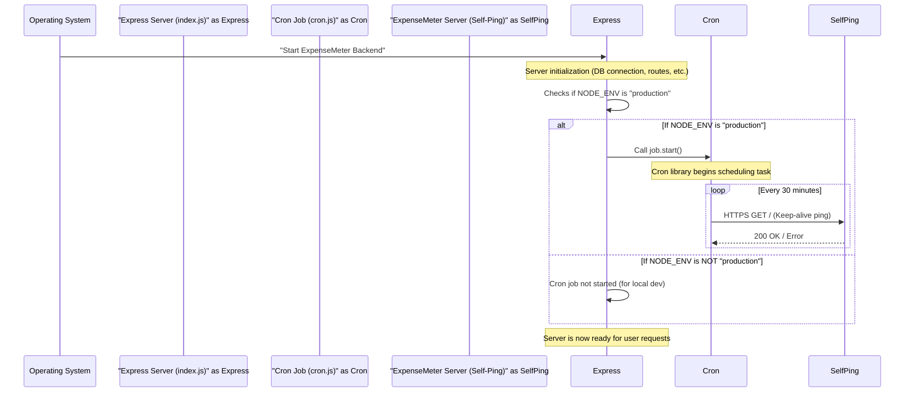

# Chapter 8: Scheduled Tasks (Cron Jobs)

Welcome back, future ExpenseMeter master! In our last chapter, [Statistics & Reporting](07_statistics___reporting_.md), we learned how to extract valuable insights from your financial data. Our server is fully configured, secure, and capable of generating detailed reports.

But what if you need certain tasks to happen automatically, without anyone actively sending a request? Imagine you want to ensure your ExpenseMeter server is always awake, or perhaps generate a daily summary report every morning at 6 AM. Who handles these "set it and forget it" operations?

This is where **Scheduled Tasks (Cron Jobs)** come in!

### The Core Idea: Your Server's Automatic Reminders

Think of **Cron Jobs** as automatic alarms or reminders you set for your computer (or in our case, our ExpenseMeter server). Just like you might set an alarm to wake you up or a reminder to pay a bill, a cron job tells your server to perform a specific task at predetermined times or intervals, even when no one is actively using the application.

In ExpenseMeter, a primary use case for a cron job is to **periodically "ping" the server itself**.

Why would we want to ping our own server?

Many free or low-cost hosting platforms (like some tiers of Render, where our ExpenseMeter backend might be deployed) have a "sleep" policy. If a service is inactive for a certain period (e.g., 15-30 minutes), the platform might put it to sleep to save resources. When someone tries to access a sleeping server, it takes time to "wake up," leading to slow responses or timeouts for the first user.

By setting up a cron job to send a "ping" (a simple HTTP request) to itself every 15-30 minutes, our ExpenseMeter server can appear "active" to the hosting platform. This helps to **keep the server "awake"**, ensuring your ExpenseMeter app remains responsive and fast when you need it.

In short, **Scheduled Tasks (Cron Jobs) automate routine operations to improve reliability and efficiency without human intervention.**

### Key Concepts: Setting the Schedule

To tell a cron job when to run, we use a special format called a **Cron Expression**. It's like a code for a schedule.

A cron expression usually consists of 5 fields (though some systems use 6):

| Field        | Description         | Allowed Values                                | Example |
| :----------- | :------------------ | :-------------------------------------------- | :------ |
| **Minute**   | Minute of the hour  | `0-59`                                        | `30`    |
| **Hour**     | Hour of the day     | `0-23` (0 is midnight)                        | `3`     |
| **Day of Month** | Day of the month | `1-31`                                        | `15`    |
| **Month**    | Month of the year   | `1-12` (or `JAN-DEC`)                         | `*`     |
| **Day of Week** | Day of the week  | `0-6` (0 is Sunday, or `SUN-SAT`)             | `*`     |

*   **`*` (Asterisk)**: Means "every" or "any" value for that field.
*   **`*/X`**: Means "every X units". For example, `*/15` in the minute field means "every 15 minutes".

Let's look at the cron expression used in ExpenseMeter:

```javascript
// From backend/utils/cron.js
const job = new CronJob("*/30 * * * *", function () {
  // ... task to perform
});
```

Here, `"*/30 * * * *"` means:
*   **Minute:** `*/30` - "Every 30th minute" (e.g., at :00, :30 past the hour).
*   **Hour:** `*` - "Every hour".
*   **Day of Month:** `*` - "Every day of the month".
*   **Month:** `*` - "Every month".
*   **Day of Week:** `*` - "Every day of the week".

So, this cron job will run **every 30 minutes, every hour, every day of the month, every month, every day of the week.** This ensures our server gets a ping frequently enough to stay awake.

### A Practical Example: Keeping the Server Awake

The cron job in ExpenseMeter performs a simple `GET` request to its own public URL. This is sufficient to signal to the hosting provider that the service is active.

Here's the simplified code for our cron job, located in `backend/utils/cron.js`:

```javascript
// File: backend/utils/cron.js (simplified)
const { CronJob } = require("cron"); // 1. Import the cron job library
const https = require("https"); // 2. Import HTTPs module for making requests

const job = new CronJob("*/30 * * * *", function () { // 3. Define the schedule and the task
  console.log("Sending keep-alive ping..."); // Just for logging purposes
  https
    .get('https://expensemeter-backend.onrender.com', (res) => { // 4. Make a GET request
      if (res.statusCode === 200) {
        console.log("✅ Keep-alive ping successful!");
      } else {
        console.log(`❌ Keep-alive ping failed with status: ${res.statusCode}`);
      }
    })
    .on("error", (e) => console.error("Error during keep-alive ping:", e)); // 5. Handle errors
});

module.exports = job; // Make the job available for other files to start
```

**Explanation:**
1.  `const { CronJob } = require("cron");`: This line imports the necessary class from the `cron` library, which allows us to create scheduled tasks.
2.  `const https = require("https");`: We need Node.js's built-in `https` module to make web requests over a secure connection.
3.  `const job = new CronJob("*/30 * * * *", function () { ... });`: This is where we create our actual cron job instance.
    *   The first argument, `"*/30 * * * *"`, is our cron expression, scheduling the task to run every 30 minutes.
    *   The second argument, `function () { ... }`, is the actual code that will run when the schedule triggers. This is our "task."
4.  `https.get('https://expensemeter-backend.onrender.com', ...)`: Inside our task function, we use `https.get` to send a simple `GET` request to the deployed URL of our ExpenseMeter backend (replace this with your actual deployed URL if different).
5.  `.on("error", ...)`: This part catches any network errors that might occur during the `GET` request.

This `job` object is then exported so that our main server file can start it when the application begins.

### How It Works Behind the Scenes: Starting the Automatic Alarm

The cron job is defined in `backend/utils/cron.js`, but it doesn't start automatically. It needs to be told to start. This happens during our [Server Initialization](06_server_initialization_.md) process in `backend/index.js`.

Here's how the entire flow works:



1.  **Server Starts**: When you start the ExpenseMeter backend (e.g., on a production hosting platform), the `backend/index.js` file begins executing, initializing the [Express Server](06_server_initialization_.md).
2.  **Environment Check**: In `backend/index.js`, there's a check `if (process.env.NODE_ENV === "production")`. This ensures that the cron job is **only started when the server is deployed live**, not during local development, saving unnecessary pings from your local machine.
3.  **Cron Job Starts**: If `NODE_ENV` is "production", `index.js` calls `job.start()`. This tells the `cron` library to begin its internal timer and schedule the function defined in `backend/utils/cron.js` according to the `"*/30 * * * *"` expression.
4.  **Periodic Pings**: Every 30 minutes, the `cron` library wakes up, executes the function we defined, which sends an `HTTPS GET` request to the server's own public URL.
5.  **Server Stays Awake**: The server receives this `GET` request, processes it like any other (though it simply returns a default "hello world" or 404 for the root `/` path), and sends a response. This activity keeps the server from being put to sleep by the hosting provider.

### Diving into the Code: Starting the Cron Job in `backend/index.js`

Here's the snippet from `backend/index.js` that brings our cron job to life:

```javascript
// File: backend/index.js (simplified snippet)
const express = require('express');
// ... other imports
const job = require("./utils/cron"); // 1. Import our cron job

const app = express();
// ... body parsers, CORS middleware, etc.

if (process.env.NODE_ENV === "production") // 2. Check if we are in production
  job.start(); // 3. Start the cron job if in production

// ... database connection, route setup, server listen
```

**Explanation:**
1.  `const job = require("./utils/cron");`: This line imports the `job` object (our configured cron job) from `backend/utils/cron.js`.
2.  `if (process.env.NODE_ENV === "production")`: This condition is important. `process.env.NODE_ENV` is an environment variable that tells Node.js whether it's running in a development, production, or testing environment. We only want our keep-alive ping to run when the server is actually deployed live, not when you're working on it locally.
3.  `job.start();`: If the condition is true (meaning we're in production), this line calls the `start()` method on our imported `job` object. This activates the cron job, and it begins running its scheduled task.

### Why Use Scheduled Tasks (Cron Jobs)?

| Without Cron Jobs (Manual / Risky)                    | With Cron Jobs (ExpenseMeter Approach)                   |
| :---------------------------------------------------- | :------------------------------------------------------- |
| **Server Sleeps**: Inactive servers become unresponsive. | **Server Stays Awake**: Pings keep it active and responsive. |
| **Manual Intervention**: Requires someone to manually trigger tasks. | **Automated Tasks**: Runs reliably without human intervention. |
| **Inconsistent Execution**: Human error, missed schedules. | **Reliable Scheduling**: Executes tasks precisely on time. |
| **Wasted Resources (Polling)**: Continuous checking consumes resources. | **Efficient**: Runs only when scheduled, not constantly checking. |
| **Limited Features**: No background data processing, reporting, etc. | **Powerful Automation**: Enables background data processing, automated reports, etc. |

By using Scheduled Tasks (Cron Jobs), ExpenseMeter ensures its backend remains responsive and can be extended to perform other useful automated operations in the future, all without you having to lift a finger!

### Conclusion

In this chapter, we've explored the power of **Scheduled Tasks (Cron Jobs)** in ExpenseMeter. We learned that these are like automatic alarms for our server, executing specific tasks on a defined schedule. By setting up a cron job to periodically "ping" itself, our ExpenseMeter backend effectively stays "awake" on hosting platforms, ensuring a smooth and responsive experience for you, the user. This foundational concept opens doors for various other automated features that can enhance the application's reliability and functionality.

---

<sub><sup>Generated by [AI Codebase Knowledge Builder](https://github.com/The-Pocket/Tutorial-Codebase-Knowledge).</sup></sub> <sub><sup>**References**: [[1]](https://github.com/gajendranasokkumar/ExpenseMeter/blob/cb7cf86a3b1c26a2af66661d5e1c888aaaf5bdfd/README.md), [[2]](https://github.com/gajendranasokkumar/ExpenseMeter/blob/cb7cf86a3b1c26a2af66661d5e1c888aaaf5bdfd/backend/index.js), [[3]](https://github.com/gajendranasokkumar/ExpenseMeter/blob/cb7cf86a3b1c26a2af66661d5e1c888aaaf5bdfd/backend/utils/cron.js)</sup></sub>