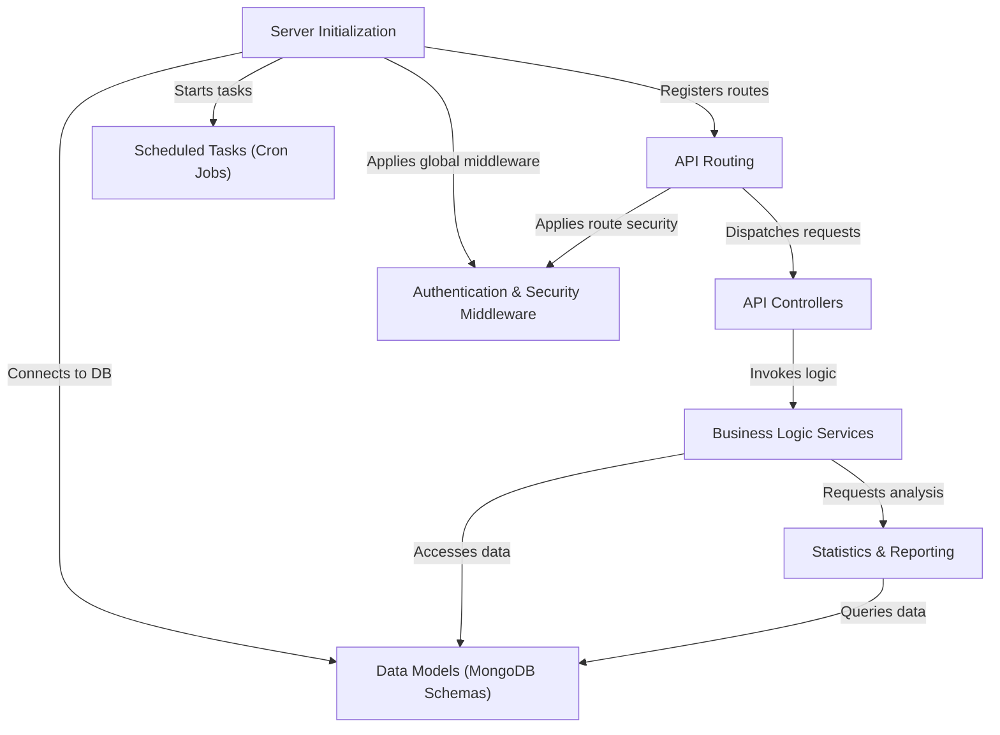

# Tutorial: ExpenseMeter

ExpenseMeter is a **mobile-first application** designed to help users *manage their personal finances* effectively. It provides tools to **track income and expenses**, set up and monitor budgets across various categories, and oversee transactions from different bank accounts. The app also generates *interactive statistics and reports* to give users clear insights into their spending habits, all backed by a secure Node.js backend with MongoDB.

## Visual Overview

## Chapters

1. [Business Logic Services
](01_business_logic_services_.md)
2. [Data Models (MongoDB Schemas)
](02_data_models__mongodb_schemas__.md)
3. [API Controllers
](03_api_controllers_.md)
4. [API Routing
](04_api_routing_.md)
5. [Authentication & Security Middleware
](05_authentication___security_middleware_.md)
6. [Server Initialization
](06_server_initialization_.md)
7. [Statistics & Reporting
](07_statistics___reporting_.md)
8. [Scheduled Tasks (Cron Jobs)
](08_scheduled_tasks__cron_jobs__.md)

---

Generated by [AI Codebase Knowledge Builder](https://github.com/The-Pocket/Tutorial-Codebase-Knowledge).