# Whatomate Entity Relationship Diagram (ERD)

```mermaid
erDiagram
    %% Domain: Identity
    ORGANIZATION ||--o{ ORGANIZATION_CONFIG : "has"
    ORGANIZATION ||--o{ USER_ORGANIZATION : "links"
    USER ||--o{ USER_ORGANIZATION : "links"
    ORGANIZATION ||--o{ CUSTOM_ROLE : "defines"
    CUSTOM_ROLE ||--o{ ROLE_PERMISSION : "contains"
    PERMISSION ||--o{ ROLE_PERMISSION : "contains"
    ORGANIZATION ||--o{ API_KEY : "owns"
    ORGANIZATION ||--o{ SSO_PROVIDER : "configures"

    %% Domain: Channels
    ORGANIZATION ||--o{ WHATSAPP_ACCOUNT : "manages"
    WHATSAPP_ACCOUNT ||--o{ WHATSAPP_INSTANCE : "contains"
    WHATSAPP_ACCOUNT ||--o{ CATALOG : "owns"
    CATALOG ||--o{ CATALOG_PRODUCT : "lists"
    WHATSAPP_ACCOUNT ||--o{ TEMPLATE : "hosts"
    WHATSAPP_ACCOUNT ||--o{ WHATSAPP_FLOW : "hosts"

    %% Domain: Messaging
    ORGANIZATION ||--o{ CONTACT : "has"
    CONTACT ||--o{ MESSAGE : "exchanges"
    CONTACT ||--o{ CONVERSATION_NOTE : "has"
    CONTACT }o--o{ TAG : "labeled_with"
    MESSAGE ||--o{ MEDIA_ASSET : "contains"
    ORGANIZATION ||--o{ CANNED_RESPONSE : "defines"
    CONTACT ||--o{ CONTACT_COLLABORATOR : "assigned_to"

    %% Domain: Automation
    ORGANIZATION ||--o{ CHATBOT_SETTINGS : "configures"
    ORGANIZATION ||--o{ KEYWORD_RULE : "uses"
    KEYWORD_RULE ||--o{ CHATBOT_FLOW : "triggers"
    CHATBOT_FLOW ||--o{ CHATBOT_FLOW_STEP : "contains"
    CONTACT ||--o{ CHATBOT_SESSION : "starts"
    CHATBOT_SESSION ||--o{ CHATBOT_SESSION_MESSAGE : "records"
    CHATBOT_FLOW ||--o{ AI_CONTEXT : "referenced_by"
    CHATBOT_SESSION ||--o{ AGENT_TRANSFER : "escalates"

    %% Domain: Operational
    ORGANIZATION ||--o{ TEAM : "has"
    TEAM ||--o{ TEAM_MEMBER : "consists_of"
    USER ||--o{ TEAM_MEMBER : "is_member"
    ORGANIZATION ||--o{ WEBHOOK : "broadcasts_to"
    ORGANIZATION ||--o{ CUSTOM_ACTION : "executes"
    ORGANIZATION ||--o{ WIDGET : "displays"
    MESSAGE ||--o{ CHAT_CLOSURE_RATING : "rated_by"

    ORGANIZATION {
        uuid id PK
        text name
        text slug
        timestamp deleted_at
    }

    USER {
        uuid id PK
        text email
        text password
    }

    CONTACT {
        uuid id PK
        uuid organization_id FK
        text whatsapp_id
    }

    MESSAGE {
        uuid id PK
        uuid organization_id FK
        uuid contact_id FK
        text body
        text direction
    }

    WHATSAPP_ACCOUNT {
        uuid id PK
        uuid organization_id FK
        text account_id
    }
```

## Domain Specifics

### Identity Isolation
Multi-tenancy is primarily enforced at the `ORGANIZATION` level. Almost all business-logic tables (Contact, Message, WhatsAppAccount) contain an `organization_id` foreign key.

### Messaging Core
The `CONTACT` entity acts as the central hub for the communication history. A contact is uniquely identified within an organization by their `whatsapp_id`.

### Chatbot Logic
The chatbot system is decoupled from core messaging. It uses `rules` to trigger `flows`, which are composed of sequential `steps`. `sessions` track active interactions and can beEscalated via `agent_transfers`.
