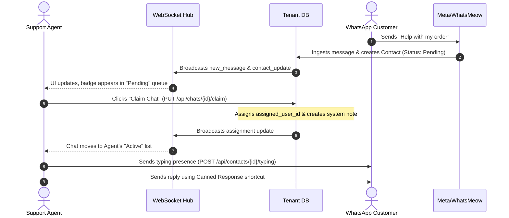

# Whatomate — Product Requirements Document (PRD)

**Version:** 1.0  
**Status:** Approved  
**Date:** June 9, 2026  
**Author:** AI Coding Assistant (Antigravity)

---

## 1. Executive Summary

### 1.1 Product Purpose
Whatomate is an enterprise-grade, open-source, multi-tenant WhatsApp Business platform. It serves as a unified multi-agent inbox, campaign execution manager, chatbot automation builder, and lead intelligence center. It is designed to run from a single Go binary embedding a Vue 3 Single Page Application (SPA), ensuring simple deployments, low infrastructure overhead, and near-zero latency.

### 1.2 Problem Statement
Many businesses need to interact with customers on WhatsApp at scale, requiring:
- Collaboration among dozens of support/sales agents.
- Automated answering via rule-based visual flow builders or AI-driven Large Language Models (LLMs).
- Bulk messaging campaigns that respect anti-spam regulations (anti-spam delays and inbound-only sending policies).
- Multi-tenant data isolation for SaaS deployment, or secure offline validation for self-hosted instances.

Whatomate resolves these challenges by providing a robust, highly performant, and secure solution supporting both the official **Meta Cloud API** and the **WhatsMeow Web protocol (WhatsApp Web)**.

---

## 2. Target User Personas

| Persona | Role | Key Needs & Pain Points |
| :--- | :--- | :--- |
| **Customer Support Agent** | Handles direct customer chats. | Wants rapid keyboard navigation, clear unread message badges, quick access to canned responses, typing presence, and clear ownership of conversations. |
| **Support/Marketing Manager** | Sets up automation, monitors agents, and drives campaigns. | Needs a drag-and-drop visual chatbot builder, campaign creation tools (CSV imports), detailed agent analytics (response times, SLA breaches), and customizable widgets. |
| **Organization Administrator** | Configures tenant-level settings. | Requires role-based access control (RBAC), API key management, security policy enforcement (phone number masking, outbound mode restriction), and SSO integration. |
| **Vendor Operations Team** | Manages the platform's commercial distribution. | Needs a reliable licensing system to activate, suspend, or audit self-hosted and hosted instances without disrupting legitimate users. |

---

## 3. Core Architecture & Concepts

### 3.1 Tech Stack Summary
- **Backend**: Go (Go 1.25.x) built with high-performance `fasthttp` / `fastglue` (no standard `net/http` to maximize throughput).
- **Database**: PostgreSQL 17 scoped per tenant via GORM, using `AutoMigrate` for schema evolution.
- **Cache & Queue**: Redis 7 for rate-limiting, session states, and tenant-scoped Redis Streams (job queues).
- **Frontend**: Vue 3 SPA built with Vite, TypeScript, Pinia (16 stores), and Tailwind CSS v3 + shadcn-vue.
- **Serving**: Single binary deployment where the compiled Vue SPA is embedded in the Go binary using `//go:embed`.

### 3.2 Key Technical Concepts
- **Multi-Tenancy Scoping**: A global database scope intercepts all GORM calls via a `TenantScope` middleware, injecting `WHERE organization_id = ?` based on the user's active session.
- **Message Provider Abstraction**: A unified `MessageProvider` interface abstracts WhatsApp operations, allowing hot-swapping between the Meta Cloud API and the WhatsMeow protocol.
- **Real-Time Synchronization**: A centralized WebSocket Hub manages connection groups scoped by organization, broadcasting message events, typing states, and status updates instantly.

---

## 4. Functional Requirements & Product Features

### 4.1 Authentication & Multi-Tenant Management
- **Single Sign-On (SSO)**: Integrates with Google, Microsoft, GitHub, Facebook, and custom OIDC providers. Supports domain whitelists and default role assignments.
- **JWT & Session Security**: Employs HS256-signed Access Tokens (15-min expiry) and single-use Refresh Tokens (7-day expiry) tracked in Redis to prevent replay attacks.
- **Organization Switching**: Allows users associated with multiple organizations to switch contexts seamlessly, returning fresh JWTs scoped to the target tenant.
- **WebSocket One-Time Tokens**: Generates 30-second single-use tokens to authenticate WebSocket handshakes securely without exposing long-lived JWTs in URLs.

### 4.2 User & Access Control (RBAC)
- **Granular Permission Matrix**: Supports custom roles mapped to specific resources and actions (`read`, `write`, `delete`, `execute`).
- **Send Restriction Policies**: Admins can restrict specific users to authorized phone numbers, designated WhatsApp instances, or mandate an "Agent Name Prefix" on outgoing messages.
- **API Key Management**: Programmatic access via `X-API-Key` headers. Secrets are cryptographically hashed (SHA-256) at rest, and prefix-masked in the UI.

### 4.3 Real-Time Chat & Inbox Management (The `/chat` Interface)
- **Multi-Account Toggles**: Agents can view and toggle between separate WhatsApp accounts associated with a single contact, keeping distinct message histories.
- **Chat Lifecycle States**:
  - `Pending`: Unassigned chats waiting in queue.
  - `Open`: Chat claimed by or assigned to an active agent.
  - `Closed`: Resolved conversations (reopenable at any time).
- **Collaboration Tools**: Invite team members as `Owner`, `Viewer` (read-only), or `Editor` (read-write) to a single chat session.
- **Phone Number Masking**: Protects customer privacy by masking numbers (e.g., `+1**********23`) for non-admin agents.
- **Service Window Indicator**: Displays a 24-hour visual countdown from the customer's last inbound message, helping agents prioritize active windows in compliance with WhatsApp Business policies.
- **Typing Presence & Reactions**: Dispatches typing states (`composing`, `paused`) and emoji reactions to WhatsApp and syncs them across agent UIs.
- **Canned Responses**: Quick replies with rich text support and attachments (up to 16MB) to accelerate common interactions.

### 4.4 Chatbot & Visual Flow Automation
- **Keyword Rules**: Matches inbound text using `Exact`, `Contains`, or `Regex` rules to auto-reply or trigger backend actions (e.g., adding tags).
- **Visual Flow Builder**: Drag-and-drop builder creating multi-step chatbot dialogs, interactive menus, and buttons.
- **AI Knowledge Contexts**: Connects to LLM providers (Gemini, OpenAI, Anthropic) using custom system prompts and organization knowledge bases for automated responses.
- **Agent Transfers**: Gracefully handoffs bot sessions to human agents, stopping automated chatbot replies when a transfer is active.
- **SLA Processing**: Monitors and flags response timers, escalation limits, and resolution delays, sending reminders or auto-closing inactive chats.

### 4.5 Campaigns & Bulk Messaging
- **Personalized Recipient Import**: Supports CSV list uploads with parameter mapping (e.g., `{{customer_name}}`), contact-based filtering, or manual text entries.
- **Queue Workers & Autoscaling**: Distributes recipient jobs across tenant-scoped Redis Streams. A background worker scales active runners based on queue backlogs.
- **Anti-Spam Controls**: Enforces random inter-message delays (default 20s–45s, absolute minimum floor of 10s) and organization-wide "Strict Inbound Only" sending policies.
- **WhatsMeow Interactive Polls**: Sends native WhatsApp polls with multi-choice vote logging (WhatsMeow only). Supports both single-select and unlimited multi-select polls. Votes are E2E-encrypted with proper LID resolution for LID-enabled sessions.
  - **Poll Vote Resolution**: When voting on polls, the system resolves phone-number JIDs to LID JIDs for correct encryption key derivation, and temporarily overrides the bot's store identity to the LID JID during `BuildPollVote()` to ensure proper E2E decryption on the recipient's device.
  - **Multi-Selection Support**: Polls with `max_selections=0` are treated as unlimited multi-select (rendered as checkboxes). Frontend UI distinguishes between single-select (radio buttons) and multi-select (checkboxes) with appropriate labels.
  - **Auto-Campaign Generator**: Runs scheduled workers to automatically generate and start campaigns targeting contacts who had inbound history in a defined window.

### 4.6 Facebook Integration
- **Account OAuth & Comment Management**: Connects Facebook pages, reads posts, and automatically replies to public comments based on rules or pushes them to WhatsApp as leads.
- **Retargeting & Page/People Search**: Searches public pages/people and logs them into custom marketing lead lists.

### 4.7 Analytics & Dashboards
- **Agent Metrics**: Logs message volume, average response time, closing counts, and SLA compliance.
- **Meta Insights**: Displays template delivery rates, read percentages, and media engagement data.
- **Custom Grid Widgets**: Allows managers to design custom analytics dashboards with movable, resizable data-source widgets.

### 4.8 Licensing & Hardening Subsystem
- **Self-Hosted Offline Validation**: Employs asymmetric Ed25519 signatures and hardware identification (HWID) to validate licenses locally without requiring constant internet attestation.
- **Hosted Attestation & Heartbeat**: Implements mTLS-backed provisioning, one-time bootstrap nonces, and outbound heartbeat check-ins every 24 hours with remote suspension controls.

---

## 5. User Scenarios & Workflows

### Scenario 1: Support Agent Daily Live Chat & Assignment

### Scenario 2: Marketing Manager Launches a Campaign from CSV
1. **Prepare Campaign**: A marketing manager logs in, navigates to `/campaigns`, and uploads a CSV file containing 500 customers with columns `phone`, `name`, and `discount_code`.
2. **Review & Map**: The UI maps `phone` to the WhatsApp destination and creates custom template parameters. Duplicate numbers are automatically merged.
3. **Draft Safety Check**: The system validates that the campaign is saved as a `draft`. The sending policy checks if "Strict Inbound Only" is enabled; if so, it highlights recipients who have never messaged the business.
4. **Queue Enqueuing**: The manager clicks "Start". The campaign status changes to `processing`, and 500 individual job payloads are written to the organization's Redis Stream `whatomate:campaigns:<orgID>`.
5. **Autoscaling & Sending**: The `WorkerScaler` detects the backlog increase and scales the queue consumer count. The workers process jobs sequentially, applying a random 20s–30s delay between sends to mimic human behavior and avoid WhatsApp spam bans.
6. **Live Monitoring**: The manager watches real-time stats (sent, delivered, read, failed) update on the dashboard via WebSocket events.

### Scenario 3: Support Manager Designs a Visual Chatbot Flow
1. **Create Flow**: The support manager opens the Visual Flow Builder at `/chatbot/flows/new`.
2. **Design Node Tree**:
   - **Trigger Node**: Starts when customer sends "price".
   - **Menu Node**: Sends interactive buttons: "1. Hosted Plans", "2. Self-Hosted Plans", "3. Talk to Agent".
   - **Action Nodes**: If "1" or "2" is clicked, trigger a pre-saved text message. If "3" is clicked, trigger an "Agent Transfer" node.
3. **AI Fallback & Context**: The manager configures the AI tab, enabling Gemini with a system prompt: *"You are an assistant for Whatomate. Answer queries about pricing using the pricing context provided."*
4. **Execution**: A customer sends "What is the cost of hosted trial?".
   - The Chatbot Processor intercepts the message.
   - It checks for active agent transfers (none exist).
   - It fails keyword matching for "price" but triggers the AI query because AI fallback is enabled.
   - The LLM parses the pricing context, generates a friendly response, and sends it to the customer.
5. **Agent Handoff**: The customer then types "I want to talk to a human". This matches the "Talk to Agent" keyword. The chatbot session is paused, an agent transfer record is created, and support agents receive a notification in their chat queue.

### Scenario 4: Admin Configures Strict Sending Restrictions
1. **Access Settings**: An organization admin opens `/settings` and clicks the **General** tab.
2. **Enable Phone Masking**: The admin toggles "Phone Number Masking" to `true`. This instantly redacts all customer phone numbers in the chat sidebar and main header (e.g., `+966*********54`) for all non-admin agents.
3. **Configure Outbound Mode**: The admin changes "Outbound Mode" to `inbound_only` and enables "Strict Sending Restrictions".
4. **Apply Restrictions**: The admin navigates to `/settings/users`, edits Agent Sarah's profile, and updates her "Send Restrictions" to allow sending only to a list of pre-approved country codes and from WhatsApp Instance `WA-01`.
5. **Policy Enforcement**: If Agent Sarah attempts to start a chat with an unapproved number or via `WA-02`, the backend's `SendRestrictionPolicy` rejects the message send request, returning a descriptive error envelope.

### Scenario 5: SaaS Vendor Attaches and Activates a License
1. **Client Registration**: A hosted client registers. The provisioning system calls the internal endpoint `/internal/license/bootstrap` to retrieve the client's `hwid_full` and generate a single-use `bootstrap_nonce`.
2. **Generate Token**: The provisioning service passes the nonce and HWID to the isolated `Private Issuer Service`.
3. **Asymmetric Signing**: The Issuer signs a license token using its private Ed25519 key, embedding the client's limits (e.g., `max_users = 10`, `max_storage_bytes = 10737418240`), the `bootstrap_nonce`, and the signing key identifier (`kid`).
4. **Activation**: The client's instance receives the token, checks the signature using the embedded public key, verifies that the nonce matches, and persists the license locally.
5. **Heartbeat Check**: Every 24 hours, the instance sends a heartbeat to the hosted control plane. If the client fails to pay their subscription, the vendor marks the deployment as suspended. The next heartbeat check returns a revocation response, causing the client's instance to transition to a `locked` state (restricting all write APIs).

---

## 6. Non-Functional Requirements (NFRs)

### 6.1 Security & Data Privacy
- **Multi-Tenant Isolation**: Database scoping must happen at the ORM layer using strict tenant filters. Under no circumstances should cross-organization queries be executed without super-admin elevation.
- **Secrets Encryption**: Sensitive credentials (WhatsApp tokens, API keys, SMTP passwords) must be encrypted at rest using AES-256 GCM before database insertion.
- **CSRF & Session Hardening**: Mutating browser requests must pass a double-submit CSRF cookie token check. Cookies must be configured as `Secure`, `HttpOnly`, and `SameSite=Lax` (or `Strict`).

### 6.2 Performance & Resource Management
- **Memory Consumption**: Keep memory usage low during bulk operations by batching database reads and limiting CSV parsing queues.
- **Virtual Scrolling**: The chat interface must render long message history lists (>1,000 messages) using virtual scrolling to prevent browser DOM lag.
- **Redis Lua Scripting**: Delay slots and rate-limiting counters must be checked atomically in Redis using Lua scripts to prevent concurrent send race conditions.

### 6.3 Usability & Localization
- **RTL Support**: The frontend layout must dynamically adjust styling when the locale is set to Arabic (`ar`), ensuring proper Right-to-Left (RTL) reading flows.
- **Keyboard Optimization**: Provide keyboard shortcuts for chat queue navigation, quick replies, and message sending.

---

## 7. Known System Gaps & Refactoring Priorities

The following architectural and functional gaps (referenced from active audits) must be addressed in upcoming milestones:

1. **Campaign Scheduler (GAP-01)**: Fully implement a background worker to consume the `ScheduledAt` field and auto-start scheduled campaign queues.
2. **WhatsMeow Delivery Receipts (GAP-02)**: Refactor `pkg/whatsmeow/events.go` to support campaign counter updates and publish live statistics over Redis pub/sub when WhatsMeow messages are delivered or read.
3. **CSV Import Size Constraints (GAP-03)**: Impose a configurable limit (e.g., 10,000 rows) on recipient imports to prevent memory exhaustion and large database write blockages.
4. **API Rate Limiting (GAP-04)**: Apply rate-limiting middleware to campaign creation, recipient importing, and media upload routes.
5. **UI State Isolation in Settings (SETTINGS-GAP-01)**: De-couple the shared `isSubmitting` state in `SettingsView.vue` to ensure each tab's saving indicator operates independently.
6. **Frontend Loading Feedback (SETTINGS-GAP-02 & 03)**: Integrate skeletons/spinners and retry-on-failure UIs for initial page loadings in `/settings`.
