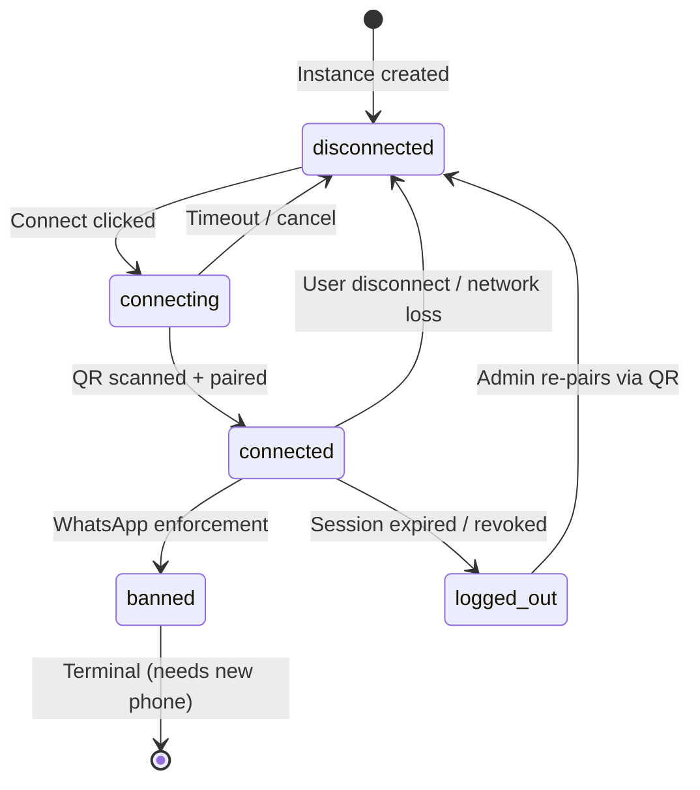

# Data Model: Whatsmeow Integration

**Feature**: `001-whatsmeow-integration` | **Date**: 2026-02-17

## New Entities

### WhatsAppInstance

| Field | Type | Constraints | Description |
|:------|:-----|:------------|:------------|
| `id` | `uuid` | PK, default `gen_random_uuid()` | Primary key |
| `organization_id` | `uuid` | FK → `organizations.id`, NOT NULL, INDEX | Tenant isolation |
| `name` | `varchar(100)` | NOT NULL, UNIQUE per org | User-friendly label (e.g., "Sales Phone") |
| `phone_number` | `varchar(50)` | nullable | Populated after QR scan from JID |
| `jid` | `varchar(100)` | nullable, UNIQUE | WhatsApp JID (e.g., `5511999999999@s.whatsapp.net`) |
| `status` | `varchar(20)` | NOT NULL, default `disconnected` | One of: `disconnected`, `connecting`, `connected`, `banned`, `logged_out` |
| `is_default` | `boolean` | default `false` | Default instance for outbound messages |
| `session_id` | `varchar(255)` | nullable | Reference to whatsmeow sqlstore device ID |
| `auto_read_receipt` | `boolean` | default `false` | Automatically mark incoming as read |
| `settings` | `jsonb` | default `{}` | Instance-specific config (rate limit overrides, etc.) |
| `last_connected_at` | `timestamp` | nullable | Tracks uptime for health dashboard |
| `created_at` | `timestamp` | auto | |
| `updated_at` | `timestamp` | auto | |
| `deleted_at` | `timestamp` | nullable, INDEX | Soft delete |

**Table**: `whatsapp_instances`
**Indexes**: `idx_wi_org` on `organization_id`, `idx_wi_jid` on `jid` (unique), `idx_wi_org_name` on `(organization_id, name)` (unique)

#### Status Lifecycle (State Machine)

### InstanceNotification

| Field | Type | Constraints | Description |
|:------|:-----|:------------|:------------|
| `id` | `uuid` | PK | |
| `organization_id` | `uuid` | FK, NOT NULL, INDEX | |
| `instance_id` | `uuid` | FK → `whatsapp_instances.id`, NOT NULL | |
| `event_type` | `varchar(30)` | NOT NULL | `banned`, `logged_out`, `error` |
| `message` | `text` | NOT NULL | Human-readable description |
| `is_dismissed` | `boolean` | default `false` | Dismissed by admin |
| `created_at` | `timestamp` | auto | |

**Table**: `instance_notifications`

## Modified Entities

### Contact (add column)

| Field | Type | Constraints | Description |
|:------|:-----|:------------|:------------|
| `instance_id` | `uuid` | FK → `whatsapp_instances.id`, nullable, INDEX | New FK for whatsmeow mode |

Existing `whatsapp_account` (string) column retained for backward compatibility.

### Message (add column)

| Field | Type | Constraints | Description |
|:------|:-----|:------------|:------------|
| `instance_id` | `uuid` | FK → `whatsapp_instances.id`, nullable, INDEX | New FK for whatsmeow mode |

Existing `whatsapp_account` (string) column retained for backward compatibility.

## Unchanged Entities

- **WhatsAppAccount**: Untouched (Strangler Pattern). Table `whatsapp_accounts` preserved for rollback.
- **Template**: Meta-only. Hidden in UI when provider is whatsmeow.
- **WhatsAppFlow**: Meta-only. Hidden in UI when provider is whatsmeow.
- **Organization**: No schema changes. Gains `WhatsAppInstances` relation in GORM model.
- **User**, **Team**, **TeamMember**: No changes.

## Migration Plan

1. **Up migration**: Create `whatsapp_instances` and `instance_notifications` tables. Add `instance_id` column to `contacts` and `messages`.
2. **Data migration** (P3, optional): For each `WhatsAppAccount`, create a corresponding `WhatsAppInstance` record and update `contacts.instance_id` and `messages.instance_id`.
3. **Down migration**: Drop `instance_id` columns, drop new tables. Old data intact in `whatsapp_accounts`.

## whatsmeow Internal Tables (managed by sqlstore)

These tables are created automatically by `whatsmeow/store/sqlstore`:
- `whatsmeow_device` — Device registration and keys
- `whatsmeow_identity_keys` — Signal protocol identity keys
- `whatsmeow_pre_keys` — Signal protocol pre-keys
- `whatsmeow_sender_keys` — Group message sender keys
- `whatsmeow_sessions` — Signal protocol sessions
- `whatsmeow_app_state_sync_keys` — App state sync

> These tables are fully managed by whatsmeow. Whatomate code MUST NOT directly read or write them.
