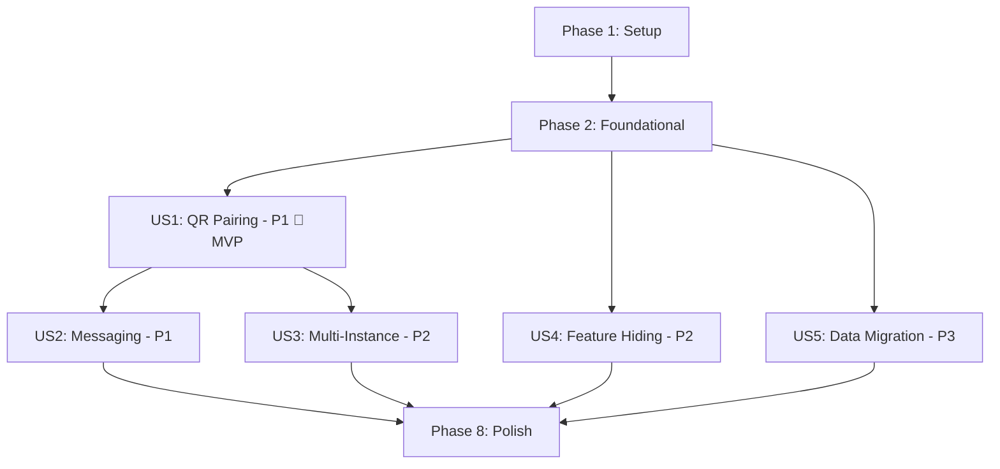

# Tasks: Whatsmeow Integration

**Input**: Design documents from `/specs/001-whatsmeow-integration/`
**Prerequisites**: plan.md ✅, spec.md ✅, research.md ✅, data-model.md ✅, contracts/ ✅

**Tests**: Not explicitly requested in spec. Test tasks omitted. Can be added via follow-up.

**Organization**: Tasks grouped by user story for independent implementation and testing.

## Format: `[ID] [P?] [Story] Description`

- **[P]**: Can run in parallel (different files, no dependencies)
- **[Story]**: Which user story this task belongs to (e.g., US1, US2, US3)
- Include exact file paths in descriptions

---

## Phase 1: Setup (Shared Infrastructure)

**Purpose**: Add whatsmeow dependency and create base project structure

- [x] T001 Add whatsmeow dependency via `go get go.mau.fi/whatsmeow@latest` and update `go.mod`
- [x] T002 [P] Add `[whatsapp]` and `[whatsmeow]` config sections to `config.toml` and `config.example.toml`
- [x] T003 [P] Add WhatsmeowConfig struct to `internal/config/config.go` (provider, rate_limit_min_delay_ms, rate_limit_max_delay_ms, queue_timeout_seconds, max_instances_per_org)
- [x] T004 [P] Create `pkg/provider/` directory and `pkg/provider/interface.go` with MessageProvider interface (SendText, SendImage, SendDocument, SendVideo, SendAudio, MarkRead, SendReaction, GetMediaURL, DownloadMedia, UploadMedia)

---

## Phase 2: Foundational (Blocking Prerequisites)

**Purpose**: Core infrastructure that MUST be complete before ANY user story can be implemented

**⚠️ CRITICAL**: No user story work can begin until this phase is complete

- [x] T005 Create WhatsAppInstance GORM model in `internal/models/instance.go` (fields: id, organization_id, name, phone_number, jid, status, is_default, session_id, auto_read_receipt, settings, last_connected_at + soft delete)
- [x] T006 [P] Create InstanceNotification GORM model in `internal/models/instance.go` (fields: id, organization_id, instance_id, event_type, message, is_dismissed, created_at)
- [x] T007 [P] Add instance status constants (disconnected, connecting, connected, banned, logged_out) and new WebSocket event type constants (qr_code, instance_connected, instance_disconnected, instance_banned, instance_logged_out, instance_qr_timeout, instance_reconnect_failed) to `internal/models/constants.go`
- [x] T008 [P] Add new WebSocket event message structs for instance events to `internal/websocket/messages.go`
- [x] T009 Add `instance_id` (uuid, nullable, FK) column to Contact model in `internal/models/models.go`
- [x] T010 Add `instance_id` (uuid, nullable, FK) column to Message model in `internal/models/models.go`
- [x] T011 Register WhatsAppInstance, InstanceNotification tables in AutoMigrate in `internal/database/` migration bootstrap
- [x] T012 Initialize whatsmeow sqlstore container using `sqlstore.NewWithDB()` with existing PostgreSQL connection at startup in `cmd/server/main.go`

**Checkpoint**: Foundation ready — database schema, models, constants, and sqlstore all in place

---

## Phase 3: User Story 1 — QR Code Instance Pairing (Priority: P1) 🎯 MVP

**Goal**: Admin creates an instance, clicks Connect, scans QR code, instance goes to "connected" status

**Independent Test**: Create instance → click Connect → scan QR → verify status is "connected" with phone number populated. Server restart auto-reconnects.

### Implementation for User Story 1

- [x] T013 [US1] Create whatsmeow connection manager in `pkg/whatsmeow/manager.go` — manages map of instance_id → *whatsmeow.Client, handles connect/disconnect/reconnect lifecycle, listens for whatsmeow events (QR code generation, pair success, disconnection)
- [x] T014 [US1] Create whatsmeow event handler in `pkg/whatsmeow/events.go` — translates whatsmeow library events (events.QR, events.PairSuccess, events.Disconnected, events.LoggedOut) into WebSocket broadcasts via Hub
- [x] T015 [US1] Create instance CRUD handler in `internal/handlers/instances.go` — POST /api/instances (create), GET /api/instances (list), GET /api/instances/:id (get), PATCH /api/instances/:id (update name/is_default/auto_read_receipt), DELETE /api/instances/:id (soft delete + disconnect)
- [x] T016 [US1] Add instance lifecycle endpoints to `internal/handlers/instances.go` — POST /api/instances/:id/connect (trigger QR pairing via manager), POST /api/instances/:id/disconnect (graceful disconnect), POST /api/instances/:id/reconnect (reconnect with stored session)
- [x] T017 [US1] Register instance handler routes in `cmd/server/main.go` route setup
- [x] T018 [US1] Wire connection manager initialization at server startup in `cmd/server/main.go` — create manager, auto-reconnect all instances with status "connected" that have stored sessions
- [x] T019 [P] [US1] Create InstancesView.vue in `frontend/src/views/InstancesView.vue` — list instances with status badges, Create Instance button, Connect/Disconnect/Delete actions
- [x] T020 [P] [US1] Create QRCodeModal.vue in `frontend/src/components/QRCodeModal.vue` — displays base64 QR image received via WebSocket, auto-refreshes on new QR events, closes on success
- [x] T021 [P] [US1] Create InstanceCard.vue in `frontend/src/components/InstanceCard.vue` — shows instance name, status badge (color-coded), phone number, last connected time, action buttons
- [x] T022 [US1] Create useInstances composable in `frontend/src/composables/useInstances.ts` — API calls (CRUD + lifecycle), WebSocket event listeners for qr_code/instance_connected/instance_disconnected events
- [x] T023 [US1] Add /instances route to `frontend/src/router/index.ts` and add navigation link to sidebar
- [x] T053 [US1] Add JID uniqueness validation in `pkg/whatsmeow/manager.go` connect flow — on pair success, check if JID already exists on another instance in the same org; if duplicate, reject connection and return clear error to frontend via WebSocket

**Checkpoint**: At this point, admin can create instances, scan QR codes, connect/disconnect — US1 fully functional

---

## Phase 4: User Story 2 — Send and Receive Messages (Priority: P1)

**Goal**: Agent sends text/media messages via whatsmeow, receives incoming messages in real-time, sees read receipts

**Independent Test**: Send a text message to a real phone number → verify delivery → reply from phone → verify reply appears in UI within 2 seconds

### Implementation for User Story 2

- [x] T024 [US2] Create whatsmeow adapter implementing MessageProvider interface in `pkg/whatsmeow/adapter.go` — SendText, SendImage, SendDocument, SendVideo, SendAudio (all using whatsmeow.Client.SendMessage), MarkRead, SendReaction, UploadMedia, DownloadMedia
- [x] T025 [US2] Create per-instance message queue with rate limiting in `pkg/whatsmeow/queue.go` — Go channel per instance, randomized delay (config: 1-3s between messages), exponential backoff on errors, 5-minute queue timeout for disconnected instances
- [x] T026 [US2] Add incoming message event handling to `pkg/whatsmeow/events.go` — handle events.Message (text, image, video, document, audio), create Contact if new, create Message record, broadcast via WebSocket as `new_message` event
- [x] T027 [US2] Add receipt event handling to `pkg/whatsmeow/events.go` — handle events.Receipt (sent, delivered, read), update Message.Status in DB, broadcast via WebSocket as `message_status_update` event
- [x] T028 [US2] Add reaction event handling to `pkg/whatsmeow/events.go` — handle events.Message with reaction type, broadcast via WebSocket as `message_reaction` event
- [x] T029 [US2] Create Meta adapter wrapper implementing MessageProvider interface in `pkg/whatsapp/adapter.go` — wraps existing Client methods to match the MessageProvider interface (Strangler Pattern: delegates to existing client.go methods without modifying them)
- [x] T030 [US2] Modify message send handler in `internal/handlers/messages.go` — route through MessageProvider interface instead of direct whatsapp.Client; select provider based on config; add optional `instance_id` parameter; use queue for whatsmeow sends
- [x] T031 [US2] Modify message read receipt handler in `internal/handlers/messages.go` — route MarkRead through MessageProvider interface
- [x] T032 [US2] Add reaction endpoint handler POST /api/messages/:id/react to `internal/handlers/messages.go`
- [x] T033 [US2] Wire MessageProvider (whatsmeow or meta adapter) selection at startup in `cmd/server/main.go` based on config.toml `[whatsapp].provider` value
- [x] T054 [P] [US2] Add group message send and receive support in `pkg/whatsmeow/adapter.go` and `pkg/whatsmeow/events.go` — handle group JIDs (`@g.us`), map group messages to correct contacts, route outbound to group via correct instance
- [x] T055 [US2] Add reply-to-message (quote context) support in `pkg/whatsmeow/adapter.go` — when `reply_to_message_id` is provided, look up the original WhatsApp message ID and include it in whatsmeow's `ContextInfo` for quoted reply rendering
- [x] T056 [US2] Add media upload retry logic in `pkg/whatsmeow/adapter.go` — on upload failure, retry once with exponential backoff; if second attempt fails, mark message as "failed" with actionable error for the agent

**Checkpoint**: At this point, agents can send/receive text, media, group messages, reply-to-message, react, and see delivery/read receipts

---

## Phase 5: User Story 3 — Multi-Instance Management (Priority: P2)

**Goal**: Admin manages multiple WhatsApp numbers simultaneously with independent health monitoring

**Independent Test**: Create 3 instances, connect all 3 via QR, send a message selecting a specific non-default instance, verify each instance operates independently

### Implementation for User Story 3

- [x] T034 [US3] Add GET /api/instances/:id/health endpoint to `internal/handlers/instances.go` — returns uptime_seconds, messages_sent_today, messages_received_today, messages_failed_today, error_rate_percent, queue_depth
- [x] T035 [US3] Add instance selection logic to message send flow in `internal/handlers/messages.go` — if `instance_id` not specified, use org's default instance; validate instance belongs to org; validate instance is connected
- [x] T036 [US3] Add health metrics tracking to connection manager in `pkg/whatsmeow/manager.go` — track per-instance message counters, connection uptime, error counts using atomic counters
- [x] T037 [P] [US3] Create HealthDashboard.vue in `frontend/src/components/HealthDashboard.vue` — per-instance cards showing connection uptime, message counts, error rates, queue depth; auto-refresh via polling (30s interval)
- [x] T038 [US3] Add instance health data to InstancesView.vue — show health metrics inline on each instance card, link to detailed health dashboard
- [x] T057 [US3] Create notification list handler GET /api/notifications and dismiss handler PATCH /api/notifications/:id/dismiss in `internal/handlers/notifications.go`
- [x] T058 [US3] Add ban/logged_out notification creation logic in `pkg/whatsmeow/events.go` — on ban or session expiry events, create InstanceNotification record and broadcast WebSocket event
- [x] T059 [P] [US3] Add notification bell icon to frontend header showing undismissed notification count with dropdown list in `frontend/src/components/NotificationBell.vue`

**Checkpoint**: At this point, multi-instance management with health monitoring and persistent notifications is fully functional

---

## Phase 6: User Story 4 — Meta Feature Hiding (Priority: P2)

**Goal**: When provider is whatsmeow, Meta-only features (templates, flows, catalog) are hidden from UI and API returns appropriate errors

**Independent Test**: Set config to `whatsapp.provider = "whatsmeow"` → verify Templates, Flows, Catalog nav items are hidden → verify API returns 404 or "feature unavailable" for those endpoints

### Implementation for User Story 4

- [x] T039 [US4] Create config handler GET /api/config in `internal/handlers/config_handler.go` — returns `{ "whatsapp_provider": "whatsmeow"|"meta", "features": { "templates": bool, "flows": bool, "catalog": bool, "business_profile": bool } }`
- [x] T040 [US4] Register /api/config route in `cmd/server/main.go` route setup
- [x] T041 [US4] Add provider guard middleware or checks to template/flow/catalog handlers — return 404 or `{ "error": "feature_unavailable", "message": "This feature requires Meta Cloud API provider" }` when provider is whatsmeow
- [x] T042 [US4] Create useConfig composable in `frontend/src/stores/config.ts` — fetch /api/config on app load, expose reactive `whatsappProvider` and `features` refs
- [x] T043 [US4] Add v-if guards to sidebar navigation and route guards in `frontend/src/` — hide Templates, Flows, Catalog nav items when `features.templates === false`, etc.

**Checkpoint**: At this point, UI and API correctly reflect available features based on active provider

---

## Phase 7: User Story 5 — Data Migration (Priority: P3)

**Goal**: Existing organizations using Meta Cloud API can migrate their contacts and message history to whatsmeow instances

**Independent Test**: Create a WhatsAppAccount with contacts/messages → run migration → verify matching WhatsAppInstance created, contacts.instance_id populated, messages.instance_id populated, original data intact

### Implementation for User Story 5

- [x] T044 [US5] Create migration service in `internal/service/migration.go` or `pkg/migration/migrate.go` — for each WhatsAppAccount: create matching WhatsAppInstance, populate instance_id on contacts and messages, log progress
- [x] T045 [US5] Create migration CLI command or admin API endpoint POST /api/admin/migrate in `internal/handlers/admin.go` — trigger migration per org or batch, return progress
- [x] T046 [US5] Add migration progress tracking to InstancesView or Admin page in frontend — show migration status (pending/in_progress/complete/failed), record counts

**Checkpoint**: Existing data can be migrated without downtime or data loss

---

## Phase 8: Polish & Cross-Cutting Concerns

**Purpose**: Improvements that affect multiple user stories

- [x] T048 [P] Add structured JSON logging for all instance lifecycle events (connect, disconnect, ban, error) in `pkg/whatsmeow/manager.go` and `pkg/whatsmeow/events.go` using logf structured fields
- [x] T051 Update CHANGELOG.md with whatsmeow integration feature summary
- [x] T052 Run quickstart.md validation — verify end-to-end flow (create instance → connect → send/receive → disconnect)

---

## Dependencies & Execution Order

### Phase Dependencies

- **Setup (Phase 1)**: No dependencies — start immediately
- **Foundational (Phase 2)**: Depends on Phase 1 — BLOCKS all user stories
- **US1 QR Pairing (Phase 3)**: Depends on Phase 2 — core MVP
- **US2 Messaging (Phase 4)**: Depends on Phase 2 + Phase 3 (needs connection manager from US1)
- **US3 Multi-Instance (Phase 5)**: Depends on Phase 3 (needs instance CRUD)
- **US4 Feature Hiding (Phase 6)**: Depends on Phase 2 only — can run in parallel with US1-3
- **US5 Data Migration (Phase 7)**: Depends on Phase 2 — can run in parallel with US1-4
- **Polish (Phase 8)**: Depends on Phases 3-7

### User Story Dependencies



### Within Each User Story

- Models before services (already in Foundational)
- Manager/adapter before handlers
- Backend handlers before frontend views
- Core implementation before integration

### Parallel Opportunities

- T002, T003, T004 can all run in parallel (Setup phase — different files)
- T006, T007, T008 can all run in parallel (Foundational — different files)
- T019, T020, T021 can all run in parallel (US1 frontend — independent components)
- T054 can run parallel with T055-T056 (US2 — different concerns)
- T037, T059 can run parallel with T034-T036, T057-T058 (US3 frontend while backend completes)
- US4 and US5 can run in parallel with US1-US3 (independent stories)

---

## Parallel Example: User Story 1

```text
# After Phase 2 completes, launch parallel backend tasks:
Task T013: Create connection manager in pkg/whatsmeow/manager.go
Task T014: Create event handler in pkg/whatsmeow/events.go

# Then sequential handler tasks:
Task T015: Create instance CRUD handler in internal/handlers/instances.go
Task T016: Add lifecycle endpoints (depends on T013)
Task T017: Register routes

# Frontend can be parallel with backend:
Task T019: Create InstancesView.vue
Task T020: Create QRCodeModal.vue
Task T021: Create InstanceCard.vue
```

---

## Implementation Strategy

### MVP First (US1 Only)

1. Complete Phase 1: Setup (T001-T004)
2. Complete Phase 2: Foundational (T005-T012)
3. Complete Phase 3: US1 QR Pairing (T013-T023)
4. **STOP and VALIDATE**: Scan QR, verify connection, restart server
5. Deploy/demo if ready — user has working WhatsApp connection

### Incremental Delivery

1. Setup + Foundational → Foundation ready
2. US1 → QR pairing works → **MVP!**
3. US2 → Send/receive messages → **Core functional product**
4. US3 → Multi-instance + health → **Differentiated product**
5. US4 → Clean UI for whatsmeow-only → **Polished product**
6. US5 → Migration path → **Enterprise-ready**
7. Polish → Notifications, logging → **Production-ready**

---

## Notes

- [P] tasks = different files, no dependencies
- [Story] label maps task to specific user story for traceability
- Each user story is independently completable and testable
- Commit after each task or logical group
- Stop at any checkpoint to validate story independently
- No test tasks generated (not requested in spec) — can be added via follow-up
